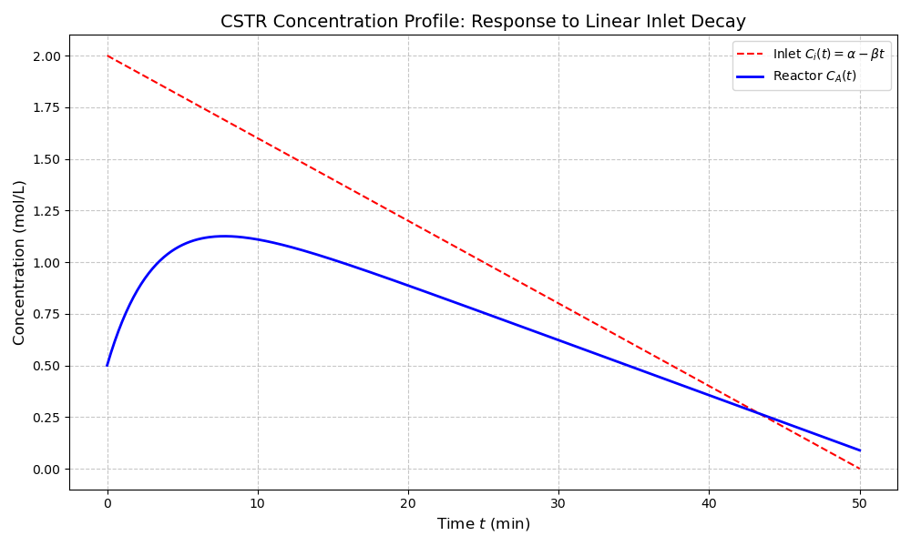

# Linear Inlet Decay Model

This sub-project analyzes the dynamic response of a Continuous Stirred-Tank Reactor (CSTR) when the reactant feed concentration decreases at a constant rate over time.

## 📝 Mathematical Formulation

The inlet concentration is defined as:
$$C_i(t) = \alpha - \beta t$$

Substituting this into the dynamic mass balance for a first-order reaction ($A \rightarrow B$):
$$\frac{dC_A}{dt} + \left( \frac{1}{\tau} + k \right) C_A = \frac{\alpha - \beta t}{\tau}$$

### Analytical Solution
The concentration inside the reactor as a function of time is:
=C_{A_0}e^{-(k+1/\tau)t}+\frac{\alpha}{k\tau+1}(1-e^{-(k+1/\tau)t})-\frac{\beta\tau}{(k\tau+1)^2}((k+1/\tau)t-1+e^{-(k+1/\tau)t}))


## 📊 Results

The simulation below illustrates how the reactor concentration ($C_A$) attempts to track the declining inlet concentration ($C_i$). 



### Key Observations
1. **The Transient Phase:** At $t=0$, the reactor concentration adjusts from its initial state ($C_{A,0}$). 
2. **The Steady-State Lag:** Even after the initial transient disappears, $C_A$ lags behind the inlet. This is due to the residence time ($\tau$)—the reactor "holds onto" previous higher concentrations.
3. **Conversion Gap:** The vertical distance between the red and blue lines represents the amount of reactant consumed by the chemical reaction ($k$).

## 🛠 Usage
Run the following script to regenerate this analysis:
```bash
python cstr_linear_decay.py
