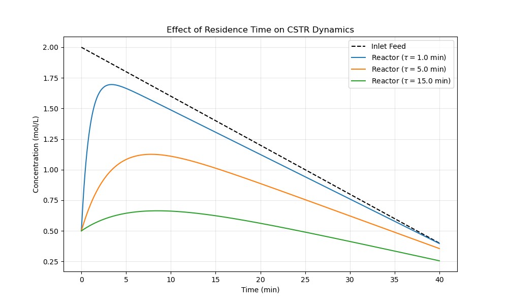

# Residence Time Sensitivity Study

This project investigates the impact of the mean residence time ($\tau$) on the dynamic performance of a CSTR. By varying $\tau$, we can visualize how the reactor volume and flow rate dictate the system's "inertia" and conversion efficiency.

## 📝 The Physics of Residence Time

The residence time is defined as:
$$\tau = \frac{V}{Q}$$

In this study, we maintain a constant reaction rate ($k$) and a constant inlet decay rate ($\beta$) while observing how different values of $\tau$ alter the concentration profile $C_A(t)$.

### The Mathematical Damping Effect
As $\tau$ increases:
1. **Damping:** The reactor becomes a more effective buffer, smoothing out changes in the inlet.
2. **Lag:** The temporal delay between the inlet concentration and the reactor response increases.
3. **Conversion:** The reactant has more time to stay in the vessel, typically leading to higher conversion (lower $C_A$).

## 📊 Results

The following plot compares the reactor response for small, medium, and large residence times.



### Key Observations
* **Low $\tau$ (1.0 min):** The reactor responds almost immediately to the feed. The "lag" is minimal, but the conversion is lower because the reactant spent very little time in the vessel.
* **High $\tau$ (15.0 min):** The reactor shows significant "inertia." It stays at a higher concentration for much longer because it contains a large volume of "old" feed that hasn't been washed out or reacted away yet.

## 🛠 Usage
To reproduce this sensitivity analysis, run the following script:
```bash
python cstr_tau_study.py
