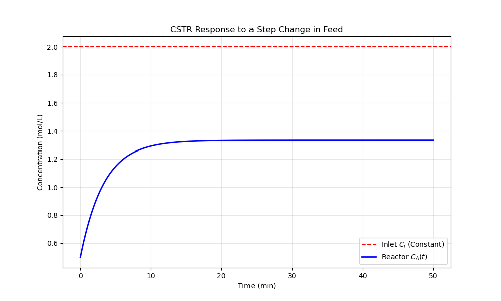

# Step Change Response Model

This sub-project explores the classic CSTR response to a "step" change in feed concentration. It characterizes the transition period between the initial reactor state and the final steady-state equilibrium.

## 📝 Mathematical Formulation

In a step change scenario, the inlet concentration remains constant over time:
$$C_i(t) = \alpha$$
*(Setting $\beta = 0$ in the general linear model)*

The simplified dynamic mass balance for a first-order reaction ($A \rightarrow B$) becomes:
$$\frac{dC_A}{dt} + \left( \frac{1}{\tau} + k \right) C_A = \frac{\alpha}{\tau}$$

### Analytical Solution
The concentration profile simplifies to a standard first-order response:
$$C_A(t) = C_{A_0} e^{-(k + 1/\tau)t} + \frac{\alpha}{k\tau + 1} \left( 1 - e^{-(k + 1/\tau)t} \right)$$

As $t \to \infty$, the reactor reaches the steady-state concentration:
$$C_{A,ss} = \frac{\alpha}{k\tau + 1}$$

## 📊 Results

The simulation illustrates the reactor's behavior as it approaches its steady-state operating point.



### Key Observations
1. **The Time Constant:** The speed at which the system reaches 99% of its steady state is determined by the combined factor $(k + 1/\tau)$.
2. **First-Order Decay:** The initial "memory" of $C_{A,0}$ decays exponentially.
3. **Steady-State Gain:** The final value is always lower than the inlet concentration ($\alpha$) due to the consumption of reactant $A$ at rate $k$.

## 🛠 Usage
To generate this plot and perform the analysis, run:
```bash
python cstr_step_change.py
