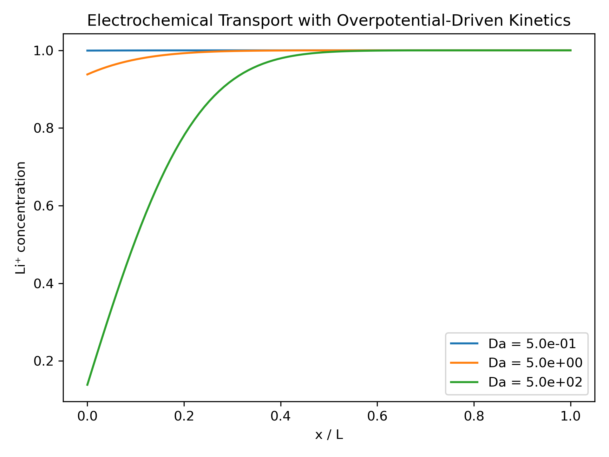

# Electrochemical Transport with Butler–Volmer Interfacial Kinetics

## 🧠 Overview
This model extends nonlinear interfacial transport by incorporating a reduced **electrochemical reaction framework based on Butler–Volmer kinetics**. In addition to Li⁺ diffusion in the electrolyte, the interfacial flux is governed by a nonlinear charge-transfer reaction that depends on both local concentration and electrochemical driving force.

The system captures the coupling between:
- Li⁺ diffusion in the electrolyte
- concentration-dependent reaction availability
- nonlinear interfacial charge-transfer kinetics

This leads to regime-dependent behavior where reaction-limited and diffusion-limited limits emerge naturally.

---

## 🔬 Key Physical Additions

### Electrochemical Interface and Overpotential
The interfacial driving force is defined through a reduced overpotential:

)

where:
- $\phi_s$ is the imposed electrode potential (solid phase, constant)
- $\ln(c)$ is a simplified Nernst-like equilibrium potential

This couples local Li⁺ concentration directly to the electrochemical driving force.

---

### Exchange Current Density
The reaction rate is modulated by a concentration-dependent exchange current density:

=\sqrt{c(1-c)})

This introduces:
- reaction-site saturation at high concentration
- vanishing kinetics at depleted regions
- nonlinear coupling between transport and kinetics

---

### Butler–Volmer Interfacial Kinetics
The interfacial flux follows a reduced Butler–Volmer form:

\left(e^{\eta}-e^{-\eta}\right))

where:
- $c$ is the Li⁺ concentration at the electrode interface  
- $n$ controls additional nonlinear reaction order effects  
- $\eta$ is the overpotential  
- $i_0(c)$ is the exchange current density  

This formulation introduces symmetric anodic/cathodic reaction pathways and strong nonlinear saturation effects.

---

## 📊 Regime Behavior

The system retains a diffusion–reaction structure but exhibits distinct regimes depending on the Damköhler number:

* **Low Damköhler Number (Da ≪ 1): Reaction-Limited Regime**
  - Interfacial kinetics dominate system behavior
  - Strong sensitivity to Butler–Volmer nonlinearity
  - Concentration profiles strongly affected by reaction terms

* **Intermediate Regime (Da ~ 1–10): Mixed Control**
  - Diffusion and interfacial kinetics compete
  - Strong coupling between boundary and bulk transport
  - Smooth transition in boundary layer structure

* **High Damköhler Number (Da ≫ 1): Diffusion-Limited Regime**
  - Transport dominates system behavior
  - Strong depletion boundary layer forms at electrode
  - Kinetic details have limited influence on bulk profiles

A key observation is that kinetic effects primarily modify reaction-limited regimes, while diffusion-limited regimes are controlled by transport constraints.

---

## 📈 Dimensionless Framework

The Damköhler number governs the competition between reaction and transport:

where:
- $k_0$ is the interfacial reaction rate constant  
- $L$ is the characteristic length scale  
- $D$ is the Li⁺ diffusion coefficient  

---

## 🛠 Numerical Methodology

The governing transport equation is:

with nonlinear Butler–Volmer boundary condition at the electrode interface:

%20\left(e^{\eta}-e^{-\eta}\right))

The system is solved using:
- Finite-difference spatial discretization  
- Explicit time integration  
- Positivity-preserving concentration updates  

---

## 🔑 Key Insight

This model demonstrates a coupled electrochemical transport system where:
- diffusion governs bulk transport
- concentration-dependent Butler–Volmer kinetics govern interfacial reactions
- exchange current density introduces nonlinear saturation effects

A key result is the emergence of regime separation:
- **reaction-limited behavior** at low Damköhler number
- **diffusion-limited behavior** at high Damköhler number

This is a fundamental feature of electrochemical systems where transport and kinetics compete.

---

## 🚀 Next Extensions

This formulation provides a foundation for more complete battery physics models, including:

- Explicit electrolyte potential field $\phi_l(x)$  
- Charge conservation and ionic current coupling  
- Full porous electrode (DFN/P2D) formulation  
- Multiscale coupling to solid-state diffusion and SEI growth models  
