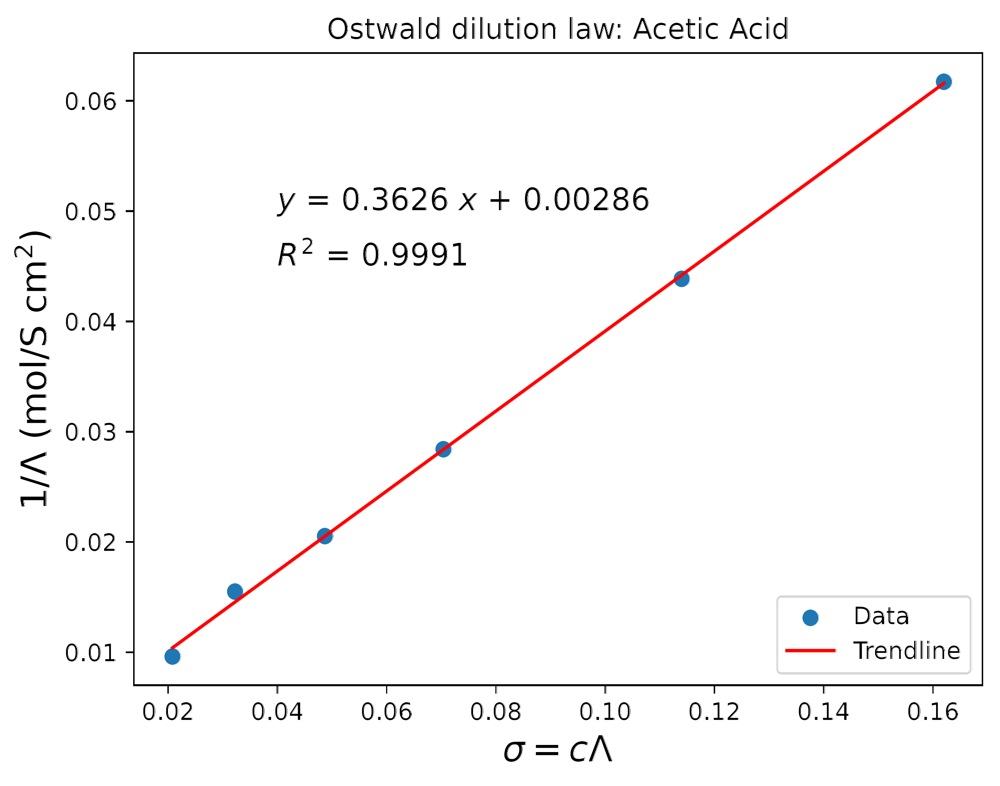

# Conductivity and Degree of Dissociation of Weak Acids

## 🧠 Overview

This project analyzes the relationship between **electrical conductivity**, **ionic dissociation**, and **chemical equilibrium** in weak electrolytes using acetic acid as a model system. By combining equilibrium thermodynamics with conductivity measurements, the model estimates both the **acid dissociation constant** and the **degree of ionization** as a function of concentration.

The analysis illustrates how macroscopic transport measurements can be used to infer microscopic equilibrium behavior in ionic systems.

---

## 🔬 Equilibrium Model

For a weak acid (such as acetic acid), the equilibrium constant \(K_a\) is related to the degree of dissociation \(\alpha\) through:

where:

- \(c_0\) is the initial acid concentration  
- \(x\) is the equilibrium concentration of the dissociated anion  
- \(\alpha = x/c_0\) is the degree of dissociation  

This expression can also be written as:

---

## ⚡ Conductivity Relation

The degree of ionization is related to the molar conductivity through:

where:

- \(\Lambda\) is the molar conductivity at concentration \(c_0\)
- \(\Lambda_0\) is the molar conductivity at infinite dilution

Substitution into the equilibrium expression gives:

This linearized form allows determination of:

- \(\Lambda_0\) from the intercept
- \(K_a\) from the slope

A key advantage of this formulation is that although \(\Lambda\) decreases with increasing concentration, the product \(\Lambda c_0\) remains relatively stable, reducing numerical sensitivity.

---

## 📊 Experimental Data

Experimental molar conductivity values for acetic acid are listed below.

| \(c_0\) | \(\Lambda\) |
|---|---|
| 0.0100 | 16.2 |
| 0.0050 | 22.8 |
| 0.0020 | 35.2 |
| 0.0010 | 48.7 |
| 0.0005 | 64.5 |
| 0.0002 | 104.0 |
| \(c_0 \rightarrow 0\) | \(\Lambda_0 = 388.6\) |

---

## 📈 Linear Regression Analysis

Linear regression of the transformed conductivity relation yields:

### Infinite Dilution Conductivity

Reported experimental value:

---

### Acid Dissociation Constant

^2}{\text{slope}}=\frac{(0.00286)^2}{0.3626}=2.26\times10^{-5})

Reported experimental value:

The agreement demonstrates that conductivity measurements provide a reliable indirect estimate of equilibrium dissociation properties.

---

## 📉 Degree of Dissociation

The degree of dissociation at each concentration is computed using:

| \(c_0\) | \(\Lambda\) | \(\alpha\) |
|---|---|---|
| 0.0100 | 16.2 | 0.046 |
| 0.0050 | 22.8 | 0.065 |
| 0.0020 | 35.2 | 0.101 |
| 0.0010 | 48.7 | 0.139 |
| 0.0005 | 64.5 | 0.184 |
| 0.0002 | 104.0 | 0.297 |

As expected for weak electrolytes, the degree of dissociation increases strongly with dilution.

---

# 🔄 Alternative Analysis

Assuming the equilibrium constant \(K_a\) is known, the degree of dissociation can be computed directly from:

}-K_a\right])

---

## ⚡ Conductivity Scaling Relation

Using the conductivity definition:

the plot of:

versus concentration \(c_0\) yields a straight line with:

- zero intercept
- slope equal to \(\Lambda_0\)

This provides an alternative method for estimating infinite-dilution conductivity.

---

## 📌 Scaling Interpretation

The degree of dissociation may also be estimated through:

where:

- \(D = c_0/\tilde{c}_0\) is a concentration scaling factor
- \(\tilde{c}_0\) corresponds to a near-infinite dilution reference concentration

This expression highlights that \(\alpha\) is not uniquely determined from the ratio \(\sigma/\tilde{\sigma}\) alone without concentration normalization.

---

## 🔑 Key Insight

This project demonstrates how equilibrium ionization behavior can be extracted from macroscopic conductivity measurements. The analysis connects:

- ionic transport
- equilibrium thermodynamics
- weak electrolyte dissociation
- conductivity scaling laws

within a unified electrochemical framework.

The results also illustrate how transport measurements can indirectly probe microscopic chemical equilibrium processes in ionic systems.
