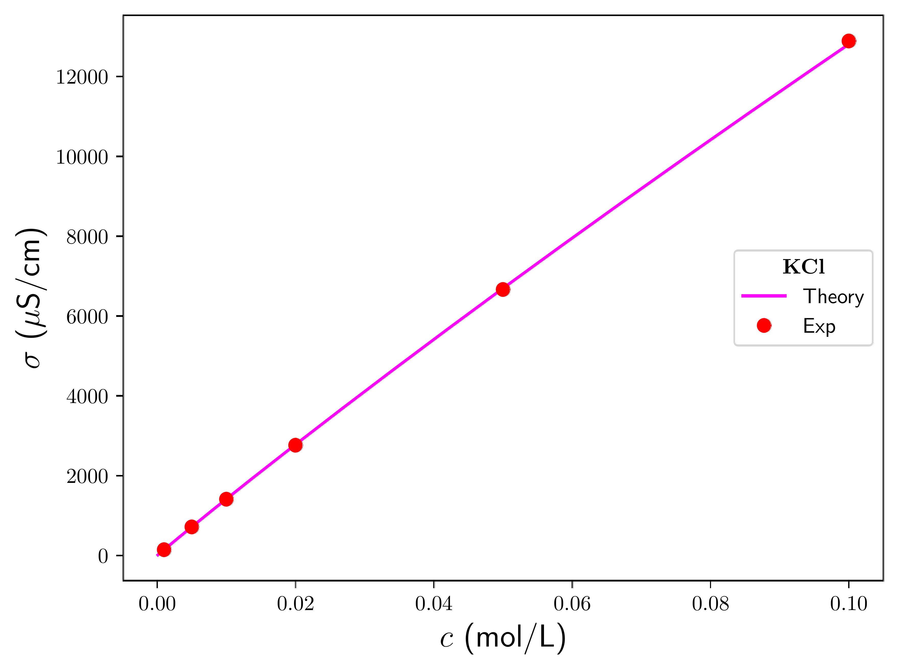
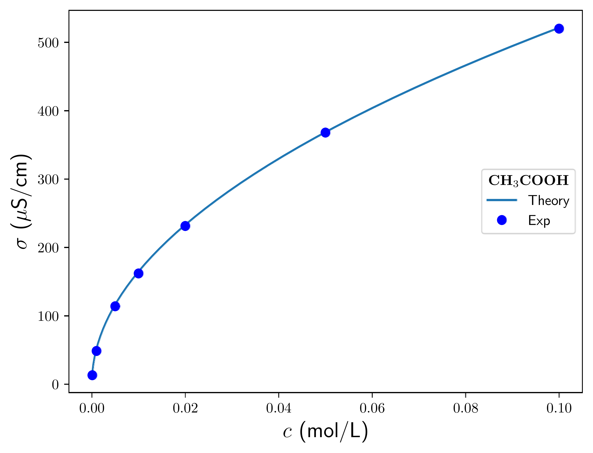
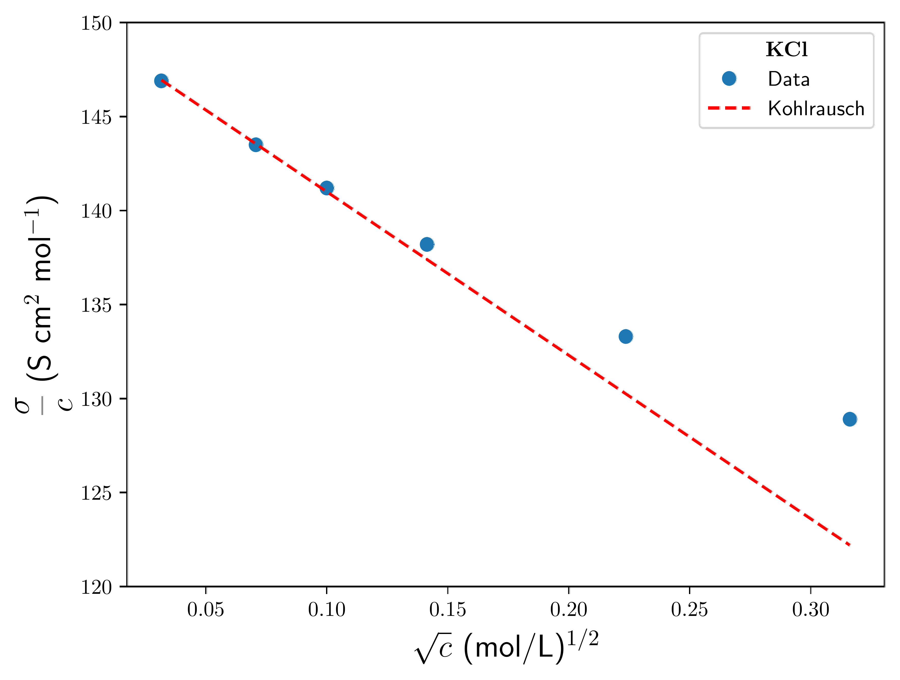

# Conductivity of Strong and Weak Electrolytes

## 🧠 Overview

This project analyzes the concentration dependence of electrical conductivity in aqueous electrolyte solutions, comparing the behavior of **strong electrolytes** (fully dissociated salts such as KCl) and **weak electrolytes** (partially dissociated acids such as acetic acid).

The study illustrates how conductivity measurements reveal fundamental differences in ionic dissociation, transport behavior, and intermolecular interactions in solution.

---

# 🔬 Strong vs Weak Electrolytes

The conductivity $\sigma$ was measured as a function of concentration for:

- Potassium chloride (KCl) — strong electrolyte  
- Acetic acid (HAc) — weak electrolyte  

The resulting conductivity curves show two important observations:

1. Strong electrolytes exhibit much higher conductivity at comparable concentrations due to complete ionic dissociation.

2. The concentration dependence differs qualitatively between strong and weak electrolytes because weak electrolytes undergo concentration-dependent dissociation equilibria.

---

## 📈 Experimental Conductivity Behavior

### Potassium Chloride (Strong Electrolyte)



### Acetic Acid (Weak Electrolyte)



---

# ⚡ Kohlrausch Law for Strong Electrolytes

Although conductivity appears approximately linear with concentration at low concentrations, strong electrolytes obey a more accurate relationship known as **Kohlrausch’s Law**.

Instead of plotting conductivity directly, one considers:

```markdown

```

where:

- $\sigma$ is conductivity  
- $c$ is concentration  
- $\Lambda_0$ is the limiting molar conductivity  
- $K$ is an empirical constant  
- $\sqrt{c}$ captures ionic interaction effects  

This relationship was originally found empirically by Kohlrausch and later derived theoretically by Onsager.

---

## 📊 Linearized Representation

The conductivity data for KCl become approximately linear when plotting:

```markdown

```



---

# 🧪 Example Data Transformation

Experimental conductivity measurements:

| $c$ (M) | $\sigma$ |
|---|---|
| 0.001 | 146.9 |
| 0.005 | 717.5 |
| 0.010 | 1412.0 |

are transformed into the linearized form:

| $\sqrt{c}$ | $10^{-3}\sigma/c$ |
|---|---|
| 0.03162 | 146.9 |
| 0.07071 | 143.5 |
| 0.10000 | 141.2 |

This transformation reveals the weak nonlinearity hidden in the original conductivity data.

---

# 🔍 Physical Interpretation

The decrease of molar conductivity with increasing concentration arises from:

- Ionic atmosphere effects  
- Electrostatic screening  
- Reduced ionic mobility at higher concentrations  

These effects are minimal at infinite dilution but become increasingly important as concentration increases.

Weak electrolytes exhibit an additional complication:

- The degree of dissociation changes with concentration  
- Conductivity depends both on ion mobility and equilibrium ionization  

This produces qualitatively different conductivity curves compared to strong electrolytes.

---

# 🛠 Numerical and Analytical Components

This project includes:

- Experimental conductivity analysis  
- Linearization of conductivity relations  
- Extraction of limiting conductivity values  
- Comparison between strong and weak electrolyte behavior  
- Visualization of transport and dissociation effects in solution chemistry  

---

# 🔑 Key Insight

Electrical conductivity provides a direct macroscopic probe of microscopic ionic behavior.

- Strong electrolytes primarily reflect ion transport physics  
- Weak electrolytes couple ion transport with chemical equilibrium  

The contrast between these systems demonstrates how transport phenomena and thermodynamic dissociation interact in electrolyte solutions.
