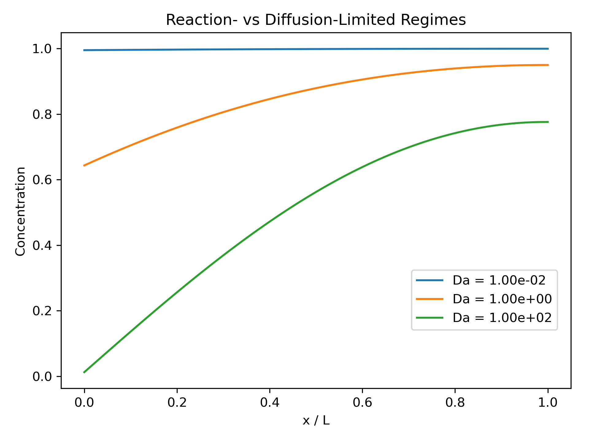

# Physics-Based Electrochemical Transport Model

## 🧠 Overview
This project investigates the interplay between **diffusive transport** and **interfacial reaction kinetics** in a simplified electrochemical system. By solving a one-dimensional reaction–diffusion equation with a reactive boundary condition, the model captures how concentration profiles evolve and how transport limitations emerge near an electrode interface.

---

## 🔬 Core Analyses
* **Transport vs Reaction:** Characterizing the competition between diffusion and interfacial kinetics.
* **Boundary Layer Formation:** Identifying concentration depletion near the reactive interface.
* **Regime Transition:** Mapping system behavior across reaction-limited and diffusion-limited regimes.

---

## 📊 Available Results

### Regime Behavior
Simulations were performed across a range of interfacial reaction rates, revealing distinct physical regimes:

* **Reaction-Limited Regime (Da ≪ 1):** Nearly uniform concentration; reaction is the limiting process.
* **Transition Regime (Da ~ 1–10):** Smooth concentration gradients as transport and reaction compete.
* **Diffusion-Limited Regime (Da ≫ 1):** Strong depletion near the interface and formation of a boundary layer.

### Dimensionless Parameter
System behavior is governed by the Damköhler number:

* $k_0$: interfacial reaction rate  
* $L$: system length  
* $D$: diffusion coefficient  

---

## 🛠 Methodology
The system is modeled using a one-dimensional diffusion equation with a reactive boundary condition:

Boundary conditions:
* **Reactive Interface (x = 0):** Flux proportional to concentration  

* **No-Flux Boundary (x = L):** Zero concentration gradient  

The equation is solved numerically using:
* Finite-difference spatial discretization  
* Explicit time stepping  
* Uniform initial concentration  

The simulations illustrate how interfacial kinetics and transport jointly determine system behavior, a key feature of electrochemical systems such as batteries.

---

## 🔑 Key Insight
The model demonstrates that system behavior is governed by a balance between **reaction kinetics** and **mass transport**. As the Damköhler number increases, the system transitions from uniform concentration profiles to transport-limited behavior with pronounced boundary layers.

---

## 🚀 Extensions
* Incorporation of electric potential and charge transport  
* Coupled electrochemical kinetics (e.g., Butler–Volmer models)  
* Extension to porous electrode and multi-scale battery systems  
