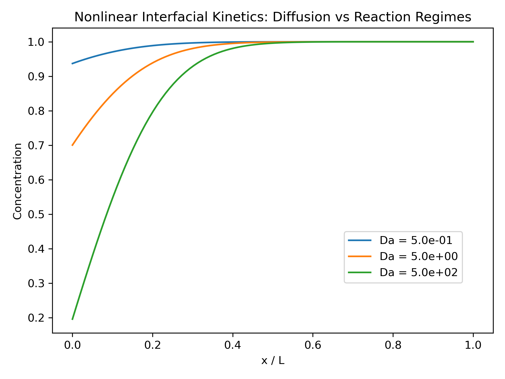

# Nonlinear Interfacial Electrochemical Transport Model

## 🧠 Overview
This project investigates the interplay between **diffusive transport of Li⁺ ions in an electrolyte** and **nonlinear interfacial reaction kinetics** in a simplified electrochemical system. By solving a one-dimensional reaction–diffusion equation with a nonlinear reactive boundary condition, the model captures how concentration profiles evolve and how transport limitations emerge near an electrode interface.

Unlike linear models, the interfacial flux depends nonlinearly on local Li⁺ concentration, leading to a clear separation between bulk transport behavior and boundary-controlled reaction dynamics.

---

## 🔬 Core Analyses
* **Transport vs Nonlinear Reaction:** Characterizing the competition between Li⁺ diffusion and concentration-dependent interfacial kinetics.
* **Boundary Layer Formation:** Identifying localized Li⁺ depletion near the reactive electrode interface.
* **Regime Transition:** Mapping system behavior across weak and strong reaction regimes using the Damköhler number.

---

## 📊 Available Results

### Regime Behavior
Simulations were performed across a range of interfacial reaction strengths, revealing distinct physical regimes:

* **Weak Reaction Regime (Da ≪ 1):** Nearly uniform Li⁺ concentration; diffusion dominates system behavior.
* **Intermediate Regime (Da ~ 1–10):** Smooth gradients form as diffusion and nonlinear reaction compete.
* **Strong Reaction Regime (Da ≫ 1):** Pronounced Li⁺ depletion near the interface and formation of a sharp boundary layer.

A key observation is that all profiles collapse in the bulk region, while differences emerge only near the reactive boundary, indicating a boundary-layer-dominated structure.

---

## 📈 Dimensionless Parameter
System behavior is governed by the Damköhler number:

- $k_0$: effective interfacial reaction rate constant  
- $L$: system length  
- $D$: Li⁺ diffusion coefficient  

The nonlinear reaction law is given by:

where $n$ controls the strength of nonlinearity in the interfacial kinetics.

---

## 🛠 Methodology
The system is modeled using a one-dimensional diffusion equation for Li⁺ transport with a nonlinear reactive boundary condition:

Boundary conditions:

* **Nonlinear Reactive Electrode Interface (x = 0):** Concentration-dependent interfacial flux  

* **No-Flux Boundary (x = L):** Zero concentration gradient (symmetry / separator condition)

The equation is solved numerically using:
* Finite-difference spatial discretization  
* Explicit time stepping  
* Positivity-preserving updates to ensure physical Li⁺ concentrations  

The simulations highlight how nonlinear interfacial kinetics modify transient evolution and generate regime-dependent boundary-layer structures.

---

## 🔑 Key Insight
The model demonstrates that system behavior is governed by a balance between **Li⁺ diffusion transport** and **nonlinear interfacial reaction kinetics**. While bulk regions remain largely insensitive to parameter variations, the electrode interface exhibits strong nonlinear sensitivity, leading to distinct depletion structures.

This separation of scales explains why different kinetic regimes can produce similar bulk Li⁺ profiles but significantly different interfacial behavior.

---

## 🚀 Extensions
* Incorporation of electric potential and electrostatic coupling (Poisson or quasi-neutral models)  
* Full Butler–Volmer kinetics with overpotential dependence  
* Explicit electrode potential coupling and current–overpotential relationships  
* Extension to porous electrode (P2D-type) multi-scale battery architectures  
