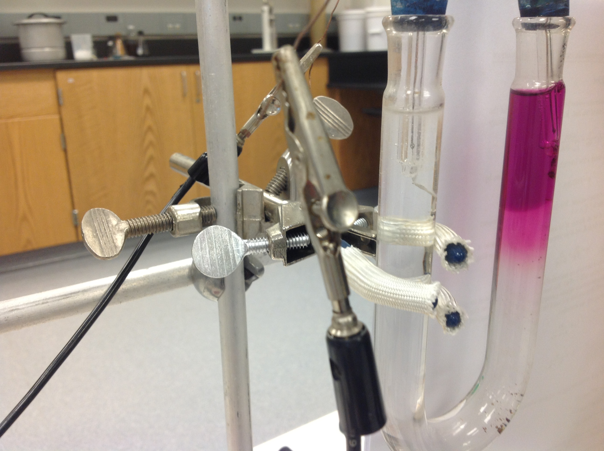
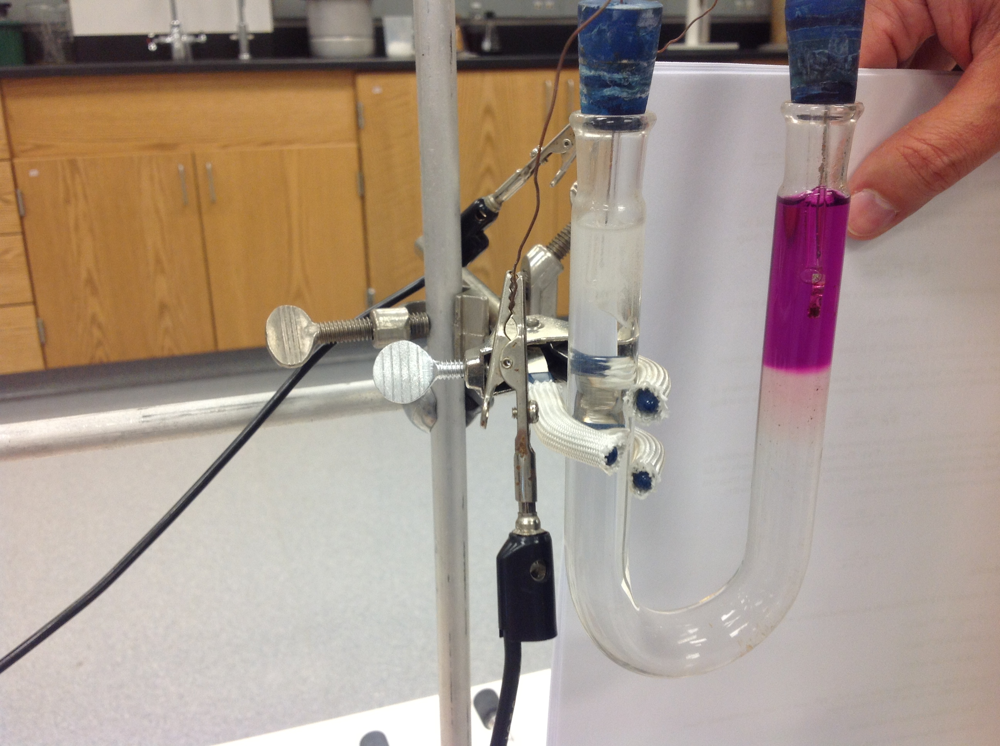

# Moving Boundary Method

## 🧠 Overview

This project explores the **moving boundary method** from both experimental and theoretical perspectives, emphasizing ionic transport and boundary propagation in electrolyte systems.

The moving boundary method was investigated through laboratory experiments in Dr. Hernández’s Electrochemistry course at Kettering University. The system shown in the images below corresponds to aqueous KNO3/KMnO4 solutions, illustrating the evolution of the electrolyte boundary during the experiment. The results demonstrate the progression of the interface between two electrolyte solutions, specifically highlighting both the displacement and sharpening of the moving boundary over time.

  
  

Experimental Configuration: To ensure gravitational stability, the system was modeled after a U-tube apparatus. The trailing KMnO4 solution was layered atop the leading KNO3 in a vertical column, creating a descending boundary. This physical arrangement, combined with the self-sharpening effect, prevents convective mixing and maintains a sharp colorimetric interface for measurement.

The moving boundary method provides a classical framework for analyzing:
*   Ionic mobility
*   Transport processes
*   Concentration gradients
*   Electrochemical migration phenomena

  
### 📝 Finding Transport Numbers and Ionic Mobilities

To determine the transport properties of a **0.1 M HCl** solution, we employed the following experimental conditions:
*   **Concentration ($c$):** $0.1\text{ M} = 100\text{ mol/m}^3$
*   **Conductivity ($\sigma$):** $4.2\text{ S/m}$
*   **Current ($I$):** $0.003\text{ A}$
*   **Cross-section ($A$):** $0.3\text{ cm}^2 = 3 \times 10^{-5}\text{ m}^2$
*   **Distance ($L$):** $3.08\text{ cm} = 0.0308\text{ m}$
*   **Time ($t$):** $1\text{ hour} = 3600\text{ s}$

---

#### 1. Transport Number ($t_+$)
The transport number for the cation ($H^+$) is calculated using the volume swept by the boundary ($V = A \cdot L$) and the total charge passed ($Q = I \cdot t$):

**$t_{H^+} \approx 0.825$**

Since , the transport number for $Cl^-$ is:
**$t_{Cl^-} = 1 - 0.825 = 0.175$**

---

#### 2. Ionic Mobilities ($u_i$)
The mobility is related to the transport number and the total conductivity of the solution:

*   **For $H^+$:**
    

*   **For $Cl^-$:**
    

---

#### 3. Molar Ionic Conductivities ($\lambda_i$)
The molar ionic conductivity () where :

*   ****
*   ****

---

### 🔑 Key Insight
The high transport number and mobility of the $H^+$ ion ($t_+ \approx 0.83$) compared to $Cl^-$ ($t_- \approx 0.17$) illustrates the unique **Grotthuss mechanism** (proton hopping) in aqueous solutions, which allows protons to move much faster than standard hydrodynamic migration.
