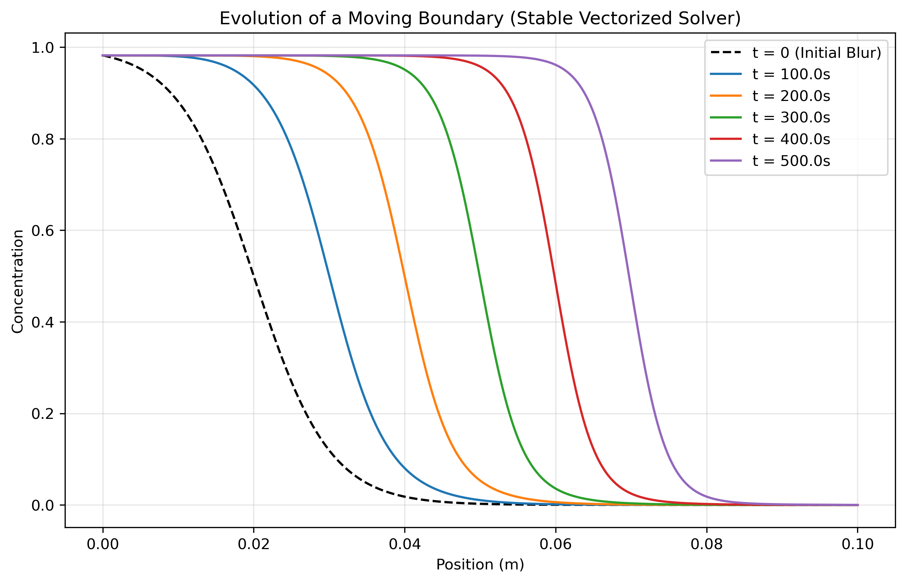

# Dynamic Simulation of the Moving Boundary Method

## 🧠 Overview
This project presents a computational simulation of the **moving boundary method**, exploring how ionic interfaces physically form and maintain themselves under an applied electric field. Moving beyond a static textbook description, this model demonstrates the real-time transition from a blurred initial state to a sharp, stable traveling wave.

The system captures the fundamental competition between:
*   **Diffusion**, which naturally dissipates concentration gradients.
*   **Restorative Electromigration**, which acts as a "focusing" force to maintain a distinct boundary.

---

## 🔬 Key Physical Mechanisms

### Profile Dynamical Model 

The interface evolution is described by the equation:

### The Self-Sharpening Effect
The core of this model is the implementation of a velocity gradient across the interface. By coupling the local migration velocity to the concentration, we simulate the higher electric field found in the trailing solution:

$$v(c) = v_{\text{lead}} + (v_{\text{trail}} - v_{\text{lead}})c$$

This velocity differential ensures that ions lagging behind the boundary are accelerated forward, while those diffusing too far ahead slow down. This "squeezing" effect is what creates the distinct interface observed in laboratory experiments like the **KCl/KNO₃** system.

---

## 📊 Observed Dynamics

The simulation reveals the characteristic the two key features of the electrochemical boundary dynamical evolution: sharpening and displacing.

---

## 🛠 Numerical Methodology

The simulation solves a non-linear transport equation using a **stable vectorized solver** developed in Python:

*   **Vectorized Processing:** Utilizing NumPy array slicing to perform updates across the entire spatial domain simultaneously, mirroring the efficiency of high-performance C++/Fortran operations.
*   **Stability Constraints:** The time integration is governed by a dynamic stability check (CFL condition) to prevent numerical oscillation or "explosion" at the sharp interface.
*   **Upwind Discretization:** Employing an upwind scheme for the migration term to ensure the traveling wave remains physically accurate and numerically stable.

---

## 🔑 Key Insight

This project demonstrates that the Moving Boundary Method is a **self-organizing system**. The sharpening observed in the lab is not a lucky coincidence of layering, but a mathematical necessity of the electric field gradient. The simulation successfully bridges the gap between the theoretical Nernst-Planck framework and the visual evidence captured in experimental photography.

<!-- 
---

## 🚀 Future Extensions

*   **Multi-Species Modeling:** Expanding the flux equations to include multiple cations and anions.
*   **Hittorf Method Comparison:** Developing a secondary module to simulate concentration changes in electrode compartments.
*   **Thermal Coupling:** Modeling the impact of Joule heating on the stability and shape of the moving boundary.

-->
