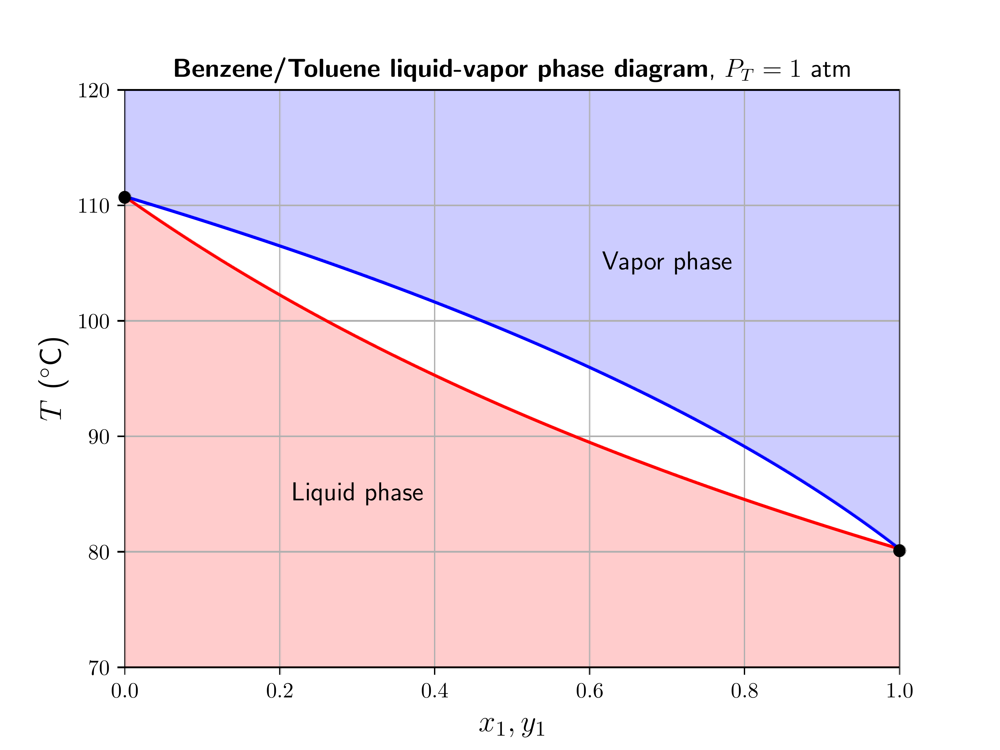

# 📊 Binary Mixtures

## 🧠 Overview
This section analyzes the **vapor-liquid equilibrium (VLE)** of a benzene/toluene mixture. Because benzene and toluene are chemically similar (both non-polar aromatics), they form a nearly **ideal mixture**, allowing for accurate use of Raoult's Law and Claussius-Clapeyron mapping of the P-axis onto the T-axis.

## 🔬 Thermodynamics of the $T-x-y$ Diagram
The phase diagram represents the equilibrium state of the binary system at a constant pressure:

* **The Bubble Point Curve (Lower Curve):** Represents the temperature at which the liquid mixture begins to boil for a given mole fraction.
* **The Dew Point Curve (Upper Curve):** Represents the temperature at which the vapor begins to condense.
* **Two-Phase Region:** The "lens" shaped area between the curves where liquid and vapor coexist in equilibrium.

## 📈 Visualization

---

## 💡 Key Insights
* **Volatility:** Benzene has a lower boiling point than toluene, making it the more volatile component. Consequently, the vapor phase is always enriched in benzene compared to the liquid phase it is in equilibrium with.
* **The Lever Rule:** Within the two-phase region, the relative amounts of liquid ($L$) and vapor ($V$) can be determined using the lever rule along a horizontal **tie-line**:
    $$n_L(z - x) = n_V(y - z)$$
    where $z$ is the overall composition, $x$ is the liquid composition, and $y$ is the vapor composition.
* **Distillation Basis:** This separation between the bubble and dew point curves is the fundamental principle behind fractional distillation.

