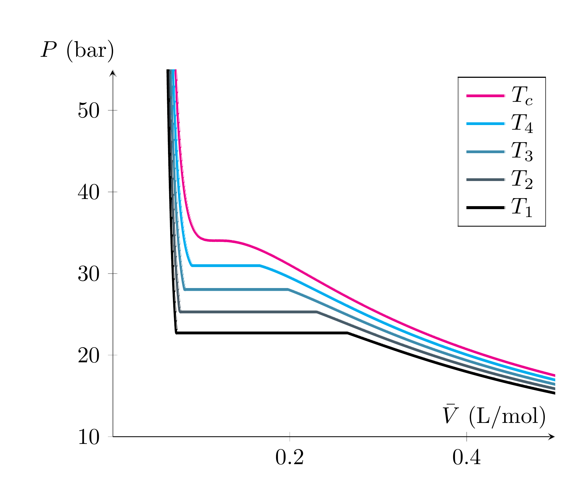
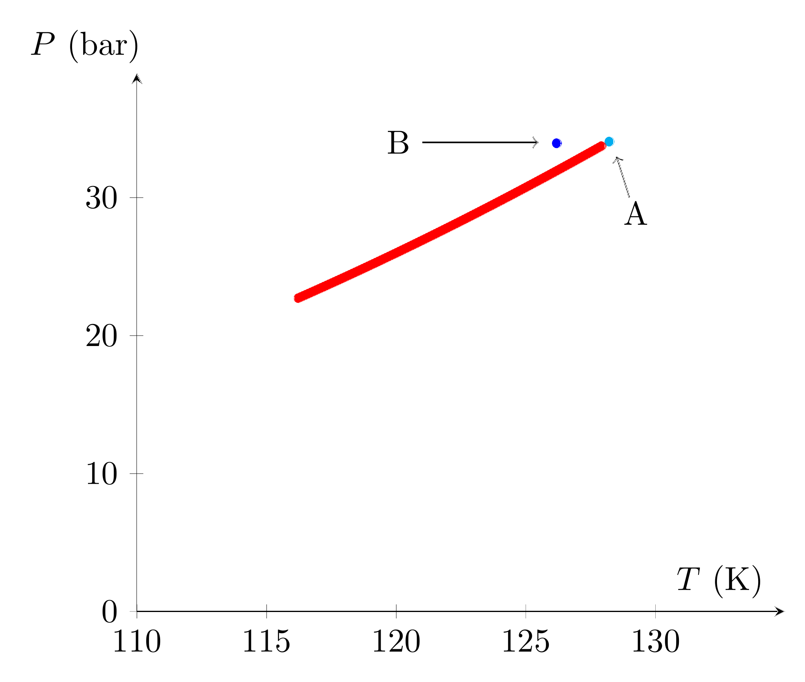
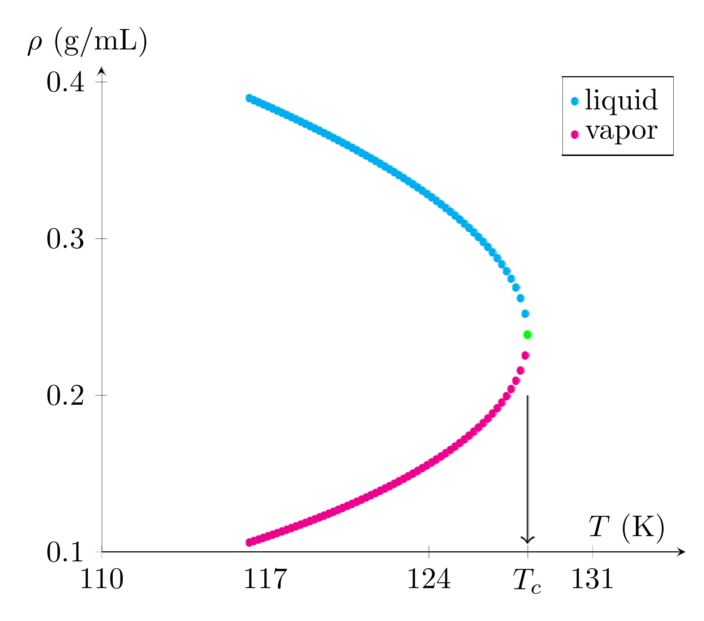
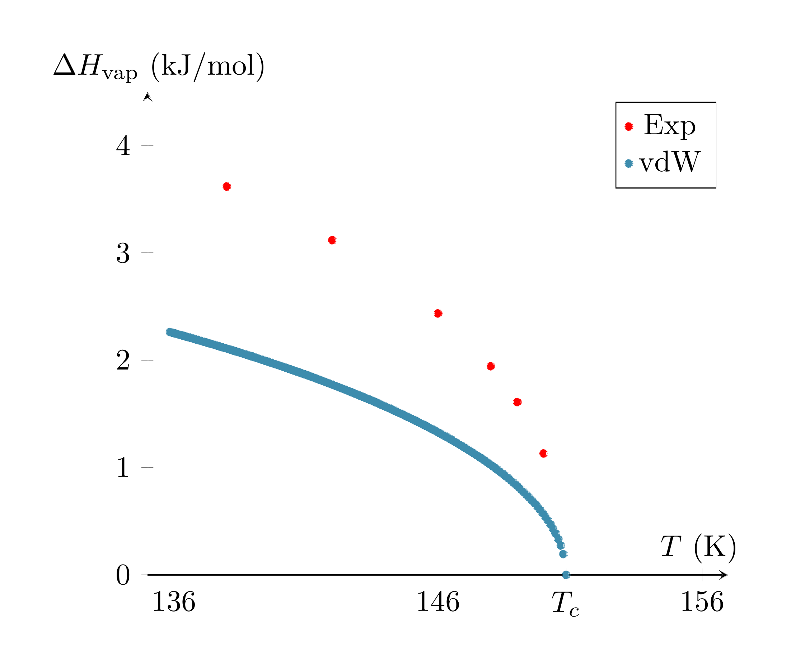

# 📊 van der Waals Equation of State

## 🧠 Overview
A great deal of information can be extracted from equations of state. Shown here are the isotherms, liquid-vapor phase diagram, liquid-vapor densities, and heats of vaporization as a function of temperature.

## 📈 Visualization

## 🔍 Description
- **Isotherms:** Critical and subcritical isotherms of nitrogen as predicted by the van der Waals equation of state.
- **Phase Diagram:** Liquid-vapor line of the nitrogen phase diagram. Point A represents the van der Waals critical point (determined by the parameters *a* and *b*), while Point B represents the experimental critical point.
- **Coexistence Densities:** Densities of the coexisting liquid and vapor nitrogen phases as a function of temperature.
- **Enthalpy Comparison:** Heat of vaporization comparison between van der Waals predictions and experimental data for argon.

## 💡 Key Insights
- **Tie-Line Shortening:** The liquid-vapor phase transition region (the horizontal segment of the isotherm) narrows as the system approaches the critical temperature. At $T_c$, the width of this transition region reaches zero, and the isotherm exhibits an inflection point.
- **Model Discrepancy:** Due to the differences between predicted and experimental critical points (points A and B), the van der Waals liquid-vapor equilibrium line deviates from experimental observations.
- **Density Convergence:** As the critical point is approached along the coexistence line, the physical distinction between the liquid and vapor phases diminishes. The densities of the two states converge until they merge into a single, homogeneous fluid phase at the critical point.
- **Thermodynamics of Vaporization:** The heat of vaporization is always positive, reflecting an endothermic process. As the system reaches the critical point and the phases merge, the enthalpy change associated with the phase transformation vanishes.

## 📌 Notes
Code for the generation of these plots and the underlying numerical solutions is available upon request.
