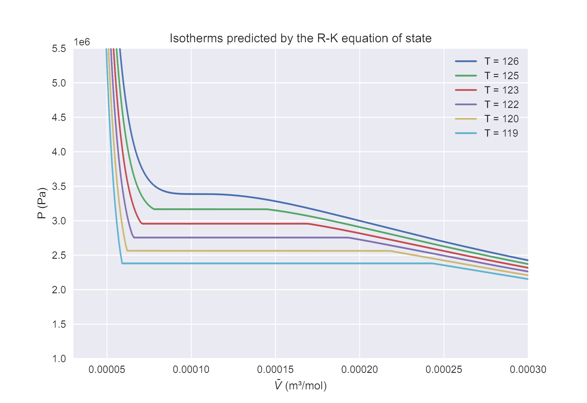
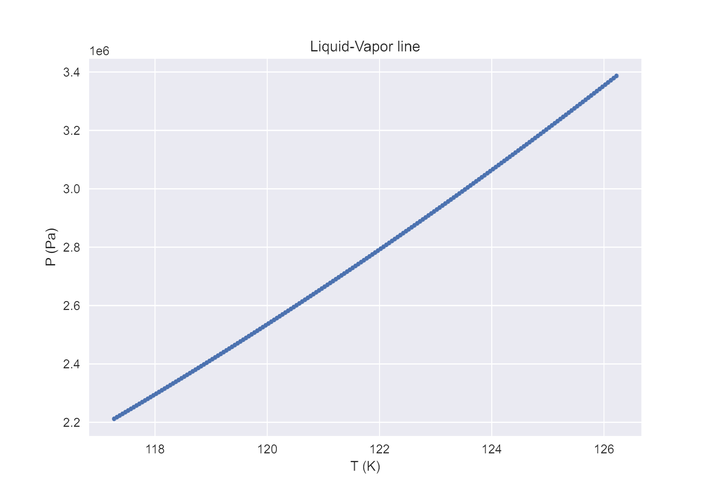
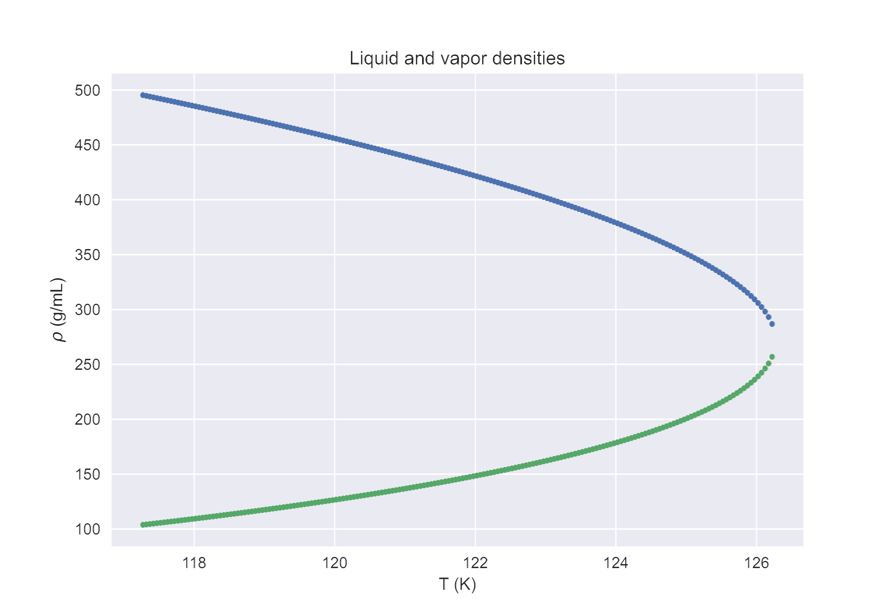
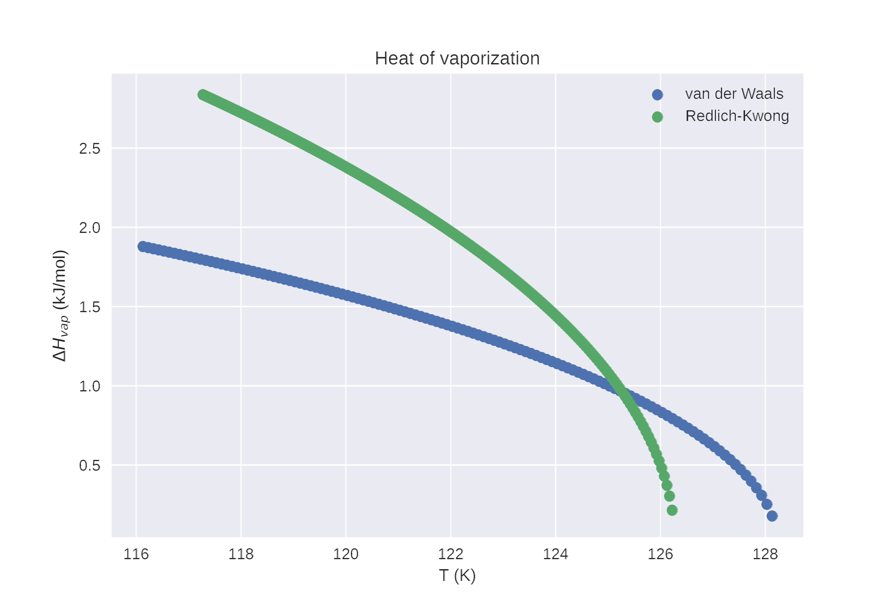

# 📊 Redlich-Kwong Equation of State

## 🧠 Overview
This project examines the **Redlich-Kwong** equation of state, which introduces a temperature-dependent attractive term to improve upon the van der Waals model. The results below showcase its performance in predicting the phase behavior and thermodynamic properties of Nitrogen.

## 📈 Visualization

## 🔍 Description
- **Isotherms:** Critical and subcritical isotherms of nitrogen as predicted by the Redlich-Kwong equation. Note the improved shape of the supercritical curves compared to simpler cubic models.
- **Phase Diagram:** Liquid-vapor line of the nitrogen phase diagram. Point A represents the Redlich-Kwong predicted critical point, while Point B represents the experimental critical point.
- **Coexistence Densities:** Predicted densities of the coexisting liquid and vapor phases. The RK model typically provides a more accurate curvature of the coexistence curve than the van der Waals model.
- **Enthalpy Comparison:** A direct comparison of the Heat of Vaporization ($\Delta H_{vap}$) calculated using both the van der Waals and Redlich-Kwong models against experimental data for nitrogen.

## 💡 Key Insights
- **Temperature Dependence:** Unlike the vdW model, the Redlich-Kwong equation accounts for the $T^{-1/2}$ dependence of the attractive forces, resulting in more accurate gas-phase volumetric predictions.
- **Improved Critical Predictions:** While cubic equations still deviate from experiment near the critical point, the Redlich-Kwong model significantly reduces the gap between predicted (A) and experimental (B) critical points compared to the van der Waals results.
- **Density Convergence:** As the critical point is approached along the coexistence line, the physical distinction between the liquid and vapor phases diminishes. The RK model demonstrates that the "dome" of the coexistence curve is more representative of nitrogen's real-world behavior.
- **Enhanced Enthalpy Accuracy:** The heat of vaporization comparison illustrates that the RK model's improved handling of the attractive pressure term leads to a better approximation of the energy required for phase transition across a broader temperature range.

## 📌 Notes
Code for the generation of these plots and the underlying numerical solutions is available upon request.
