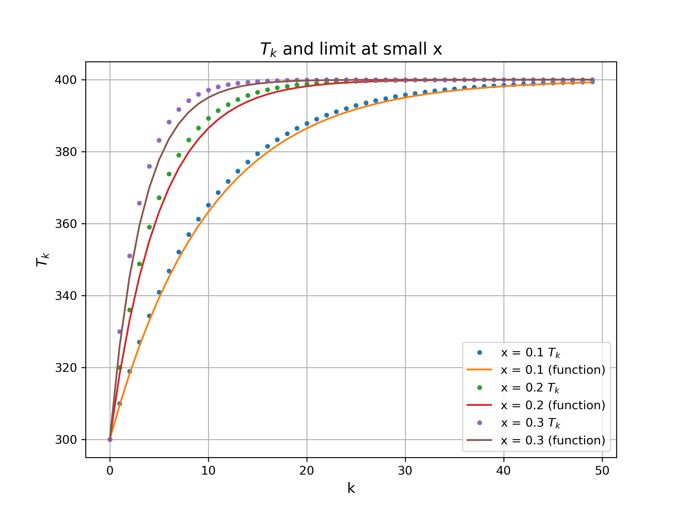

# Discrete Thermalization and Dynamical Heat Transfer

## 🧠 Overview
This project explores the transition from discrete thermalization events to continuous dynamical heat transfer. By analyzing a series of successive thermal contacts between two liquid masses at different temperatures, the model demonstrates how a kinetic process—typically described by differential equations—emerges at the limit of infinite discrete thermalization processes.

---

## 📝 Exercise: Sequential Thermal Contact

### 1. Equilibrium of Two Masses
Consider masses  and  of the same liquid at temperatures  and , where . When placed in thermal contact, the heat lost by A is absorbed by B:

%20+%20m_B%20%5Chat%7BC%7D%20(T%20-%20T_B))

Solving for the final temperature :

%20T_B)

where .

### 2. Successive Thermalization Events
A large mass  is thermalized by successive contacts with a much smaller mass  (always at ). Let  and  be the temperature after  contacts. The recurrence relation is:

)

The resulting temperature can be written as:

where:
*   %5Ek)
*   %5Ek)

### 3. The Continuous Limit
In the limit where , we use the approximation %20%5Capprox%20-x):

%5Ek%20%3D%20%5Clim_%7Bx%20%5Cto%200%7D%20e%5E%7Bk%5Cln(1-x)%7D%20%5Capprox%20e%5E%7B-kx%7D)

The temperature at step  for very small  becomes:

%20e%5E%7B-kx%7D)

---

## 📊 Numerical Visualization
For , , and , the discrete steps (points) are compared against the limiting exponential form (line):

  

The smaller the ratio , the greater the agreement between the discrete events and the continuous curve.

---

## 🔑 Key Insight: Connection to Kinetic Models
This exercise demonstrates that a dynamical heat transfer process can be modeled without differential equations by treating it as a limit of discrete events.

By defining the total mass added at time  as , the discrete solution maps directly to the standard kinetic heat transfer model:

%20%3D%20T_A%20-%20(T_A%20-%20T_B)%20e%5E%7B-(%5Cdot%7Bm%7D/M)t%7D)

**Underlying Assumptions:**
*   **Time Scales:** The rate of thermal equilibration is assumed to be instantaneous compared to the rate of mass addition.
*   **Mass Conservation:** The rate of mass exit must equal the rate of mass addition () to keep the total system mass  constant.
