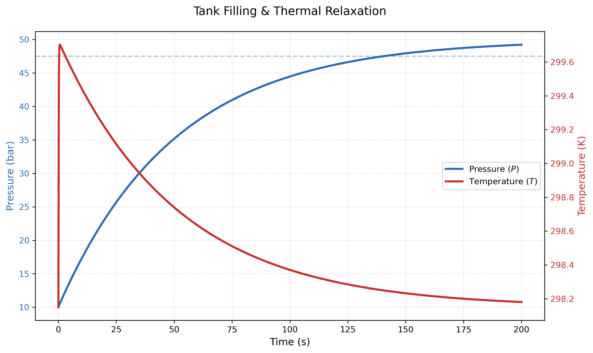

# Kinetic Modeling of Transient Tank Filling & Thermal Relaxation

## 🧠 Overview
This project investigates the continuous dynamical response of a rigid vessel during a high-pressure filling process. Moving beyond static "before and after" textbook states, this model captures the **real-time evolution** of pressure and temperature. 

The simulation demonstrates a critical thermodynamic principle: the adiabatic conversion of **flow work** into internal energy creates a rapid temperature spike, followed by a slower thermal relaxation back to ambient conditions. By coupling mass transport with Newton's Law of Cooling, we characterize the asymptotic approach to equilibrium.

---

## 🔬 Dynamical Governing Equations

### 1. Coupled Mass & Energy Transport
The system is modeled as an unsteady-state open system. The rate of change of the molar holdup $n$ and temperature $T$ are governed by the following coupled differential equations:

**Molar Flux (The Driver):**  
The filling rate is proportional to the pressure gradient across the inlet valve:

)

**Energy Balance (The Response):**  
The temperature evolution is a competition between the enthalpy influx (heating) and convective heat loss (cooling):

-hA(T-T_{amb})}{n\bar{C}_V})

where $hA$ is the thermal conductance and $k$ is the valve conductance.

### 2. Pressure Coupling
The pressure is linked to the state variables through the derivative of the Ideal Gas Law:

)

---

## 📊 Observed Kinetic Behavior

Unlike discrete models, the continuous simulation reveals a distinct **thermal hump**. As the pressure differential is highest at $t=0$, the temperature spikes nearly 140 K above ambient. As the flow rate decays asymptotically, the "cooling" term dominates, and the temperature relaxes back toward the ambient reservoir.

  

### The 95% Convergence Criterion
Because the driving force vanishes as equilibrium is approached, the system is mathematically asymptotic. We define the **Practical Filling Time** as the point where:

\ge0.95P_{line})

*   **Initial Phase:** Rapid pressure gain and maximum thermal stress.
*   **Relaxation Phase:** Minimal mass transfer as the system sheds excess thermal energy to reach stable storage pressure.

---

## 🛠 Numerical Implementation: Stiff ODE Integration

Modeling this process requires handling significant **numerical stiffness**. At the start of the simulation, the low molar holdup ($n$) in the denominator of the energy balance makes the temperature gradient extremely sensitive to small fluctuations.

*   **Stiff Solver Selection:** The simulation utilizes the **Radau method** (an implicit Runge-Kutta scheme) to maintain stability during the initial high-gradient phase.
*   **Precision Control:** Tightened absolute and relative tolerances were implemented to eliminate numerical "chatter" and ensure a smooth physical trajectory.
*   **Vectorized Evolution:** Developed in Python using `SciPy.integrate`, the model allows for rapid sensitivity analysis of valve conductance versus cooling rates.

---

## 🔑 Key Insight
This project demonstrates that **equilibrium is a kinetic destination.** The "final state" of 50 bar is not reached instantly; its approach is governed by the physical constraints of the hardware. The observation that temperature peaks and then drops *while filling is still occurring* highlights the non-linear interplay between work, heat, and time—essential knowledge for designing safe high-pressure gas infrastructure.
