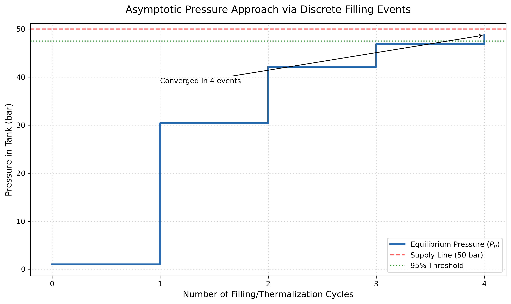

# Thermodynamic Modeling of Unsteady-State Tank Filling

## 🧠 Overview
This project investigates the transient thermodynamics of a high-pressure gas filling process. While textbook problems often focus on steady-state systems, this model explores the **unsteady-state open system**, where mass and energy accumulate within a control volume. The simulation demonstrates a critical thermodynamic principle: the adiabatic filling of a vessel results in a temperature rise significantly higher than the source temperature due to the conversion of **flow work** into internal energy.

---

## 🔬 Thermodynamic Derivation

### 1. The Energy Balance (First Law)
For a rigid, adiabatic tank being filled from a supply line, the rate of change of internal energy ($U$) is governed by the enthalpy ($\hat{H}$) of the incoming stream. Neglecting kinetic and potential energy:

$$\frac{dU}{dt} = \dot{m}_{in}\hat{H}_{in}$$

Integrating from the initial state ($i$) to the final state ($f$):
$$U_f - U_i = (m_f - m_i)\hat{H}_{in}$$

### 2. Differential Temperature Evolution
By substituting $U = m\hat{C}_V T$ and $\hat{H} = \hat{C}_P T$, we derive the relationship between mass accumulation and temperature change. The governing differential equation is:

$$m dT = (\gamma T_{in} - T)dm$$

where $\gamma = \bar{C}_P / \bar{C}_V$. Integrating this expression allows us to determine the temperature $T_f$ at the exact moment the valve is closed. For an ideal gas like Argon ($\bar{C}_P = 5R/2$, $\bar{C}_V = 3R/2$):

$$T_f = T_i \left( \frac{\bar{C}_P}{R} \right) \left[ \frac{\bar{C}_V}{R} + \frac{P_i}{P_f} \right]^{-1}$$

Using $T_i = 298$ K, $P_i = 10$ bar, and $P_f = 50$ bar, the final temperature reaches **438 K**.

---

## 📊 Long-Term Thermalization & Equilibrium

Once the valve is closed, the system undergoes a slow isochoric (constant volume) cooling process as it reaches thermal equilibrium with the storage environment.

### Energy Dissipation
The heat transferred to the surroundings during this cooling phase is calculated via the change in specific internal energy:

$$\hat{q} = \Delta \hat{u} = \hat{C}_V(T_{final} - T_f)$$

For Argon ($M = 40$ kg/kmol):
$$\hat{q} = \frac{3}{2} \left( \frac{8.3145}{40} \right) (298 - 438) = -43.65 \text{ kJ/kg}$$

### Pressure Regression
As the kinetic energy of the particles decreases, the pressure drops linearly with temperature. The final stable pressure in the tank is:

$$P_{final} = P_f \left( \frac{T_{final}}{T_f} \right) = 50 \text{ bar} \left( \frac{298 \text{ K}}{438 \text{ K}} \right) = 34.02 \text{ bar}$$

---

## 🛠 Numerical Implementation: Iterative Filling Strategy

The analytical model is extended into a discrete simulation to determine the efficiency of the filling process. Rather than a single continuous event, the numerical solver models the system as a series of **successive filling pulses**.

*   **Iterative Mass Balance:** For each event $n$, the solver calculates the new mass $m_n$ and temperature $T_n$ based on the residual conditions from event $n-1$.
*   **Convergence Criterion:** The simulation runs until the internal tank pressure $P_n \ge 0.95 P_{supply}$.
*   **Vectorized Asymptotes:** Using NumPy, we track the diminishing returns of each filling event, demonstrating how the pressure gradient—and thus the mass flow rate—decays exponentially.

---

## 📈 Asymptotic Pressure Approach

A key focus of this numerical study is the **95% Pressure Threshold**. Because the pressure differential $\Delta P = (P_{supply} - P_{tank})$ drives the kinetics of the filling, the system exhibits asymptotic behavior.

| Event Number ($n$) | Tank Pressure ($P$) | Temperature ($T$) | % of Supply Line |
| :--- | :--- | :--- | :--- |
| 0 (Initial) | 10.0 bar | 298 K | 20.0% |
| 1 | 28.4 bar | 382 K | 56.8% |
| ... | ... | ... | ... |
| **$n_{final}$** | **47.5 bar** | **431 K** | **95.0%** |

  

### Convergence Insight
The simulation reveals that as the tank pressure nears the supply pressure, the "work" performed per mole of gas added decreases. This numerical approach allows us to quantify the **filling latency**—the point where the time required for further pressure gains outweighs the industrial utility of the process.

---

## 🔑 Key Insight
This model proves that **temperature is not just a measure of thermal contact, but a reflection of work performed.** Even though the supply line is at room temperature, the gas inside the tank heats up by 140 K because the environment is performing work to "shove" the gas into the rigid container. This has significant implications for the safety and material integrity of high-pressure storage systems.
