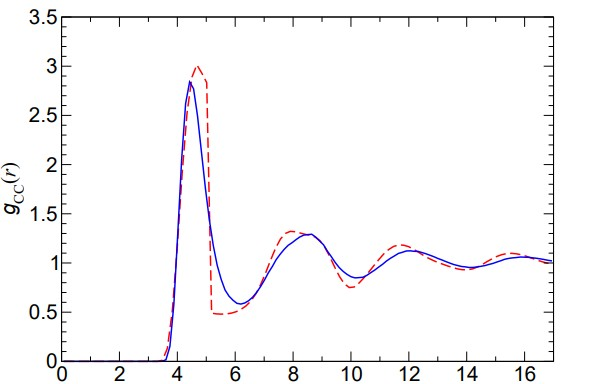
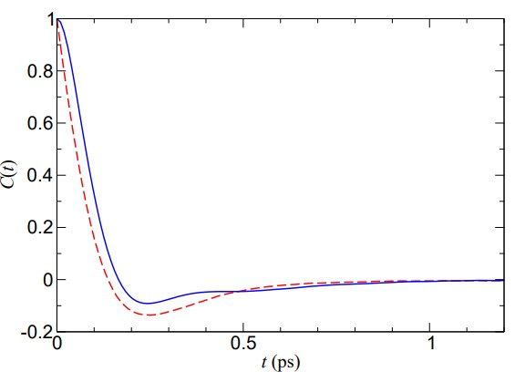
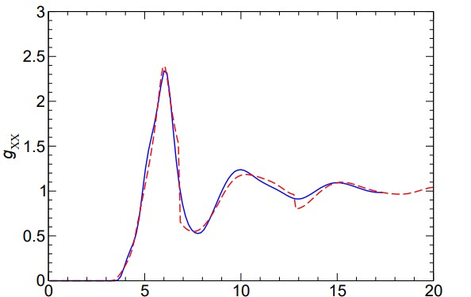

# Event-Driven Simulations of Rigid and Semiflexible Bodies

## 🧠 Overview
This project establishes a general framework for performing event-driven molecular dynamics (EDMD) simulations of systems with rigid or semiflexible bodies interacting via impulsive, discontinuous forces[cite: 1]. The methodology focuses on computing free evolution under constraints and determining interaction consequences, offering a highly efficient alternative to standard continuous-potential molecular dynamics[cite: 1].

## 🔬 Core Analyses
* **Algorithmic Development:** Methods for evaluating interaction times and computing the free evolution of constrained motion[cite: 1].
* **Performance Benchmarking:** Comparative analysis showing the EDMD approach is 3 to 100 times more efficient than standard methods, depending on simulation conditions[cite: 1].
* **Angular Dynamics:** Investigation of rotational motion and the impact of discontinuous repulsive interactions in non-spherical molecular systems[cite: 1].

---

## 📊 Available Results

### Spherical & High-Symmetry Systems
Select a model below to view results for systems with symmetric mass distributions:

* **Rigid vs. Semiflexible Motion:** *Characterization of analytical free motion in rigid bodies versus numerical integration requirements for semiflexible cases[cite: 1].*

* **Methane EDMD Study:** *The figures below show a comparison of discontinuous [red] and standard Lennard-Jones potentials [blue], reproducing essential structural and dynamical features of liquid methane. The C-C radial distribution function appears on the left and the velocity-velocity time correlation function appears on the right.*

  
  

### Complex Molecular Architectures
* **Benzene Liquid Model:** *Application of the rigid discontinuous method to benzene, shows a qualitative agreement with detailed continuous-potential models regarding equilibrium and dynamical properties. The figures below show the center-center radial distribution function (left) and the velocity time correlation function for liquid benzene.*

  
  

---

## 🛠 Methodology
The simulations utilize an **event-driven framework** that calculates the exact times of interaction events rather than using fixed time steps[cite: 1]. This approach is applied to rigid-body systems where free motion can be computed analytically, utilizing discontinuous potentials to capture the essential physics of molecular attraction and repulsion with significantly reduced computational cost[cite: 1].

## 📌 Notes
- [Discontinuous molecular dynamics for semi-flexible and rigid bodies](https://doi.org/10.1063/1.2434957)
- [Discontinuous molecular dynamics for rigid bodies: Applications][(https://doi.org/10.1063/1.2434957)

