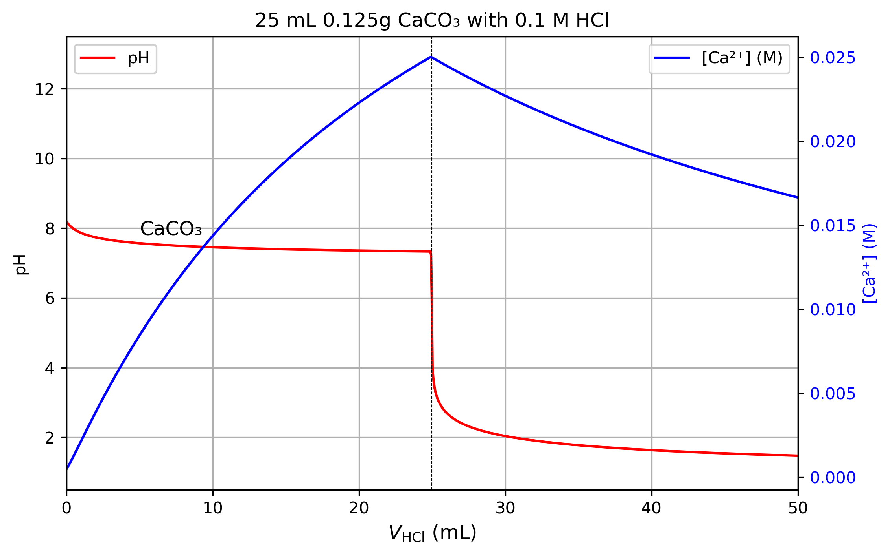
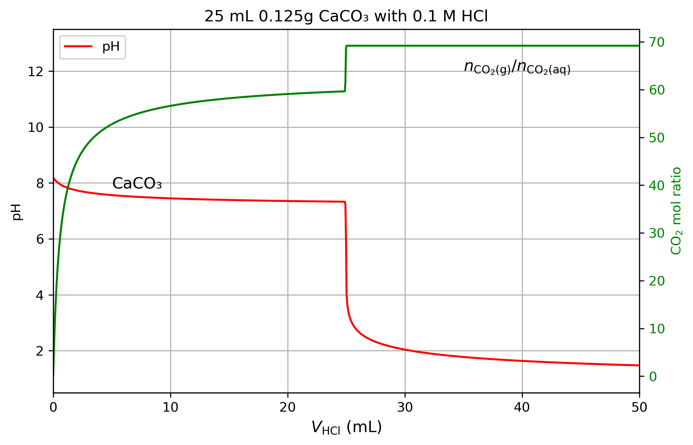
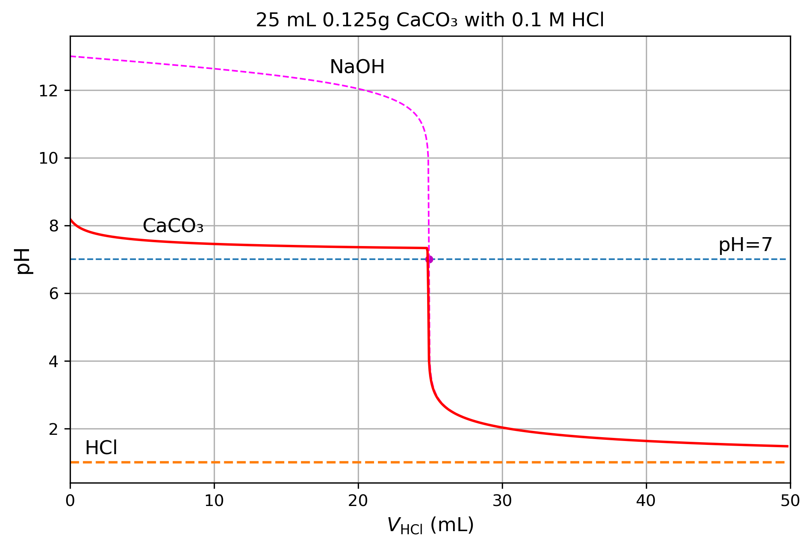

# 📊 Antacid Analysis

## 🧠 Overview
This repository analyses the **direct titration** curves of CaCO3 with hydrochloric acid (HCl), a weak acid (KHP). These results are obtained by solving the full system of equilibrium equations including the solubility equilibrium of CaCO3, the carbonic equilibrium and the water equilibrium.

## 📈 Visualization

## 🔍 Description
- **CaCO3 buffer and Ca dissolution:** The first figure shows the titration curve pH vs volume of HCl for CaCO3 in solution. It also shows the dissolution of Ca^2+ ions as the titration avances.
- **Polyprotic Acid:** The titration curve of maleic acid, demonstrating the coupled **multi-ionic equilibrium** of a diprotic system.

## 💡 Key Insights
- The HCl and KHP curves converge after the equivalence point as the pH is dominated by the concentration of excess titrant.
- The HCl equivalence point occurs at neutral pH, while that of KHP is at a basic pH, reflecting the conjugate base hydrolysis.
- These curves are generated by solving the full set of non-linear equilibrium equations (mass balance, charge balance, and water autoprotolysis).
- This approach ensures high-fidelity results even in the extreme dilute limit or near equivalence points where standard approximations (like the Henderson-Hasselbalch equation) typically lose accuracy.

## 📌 Notes
The Python code used for the generation of these plots and the underlying numerical root-finding solutions is available upon request.

