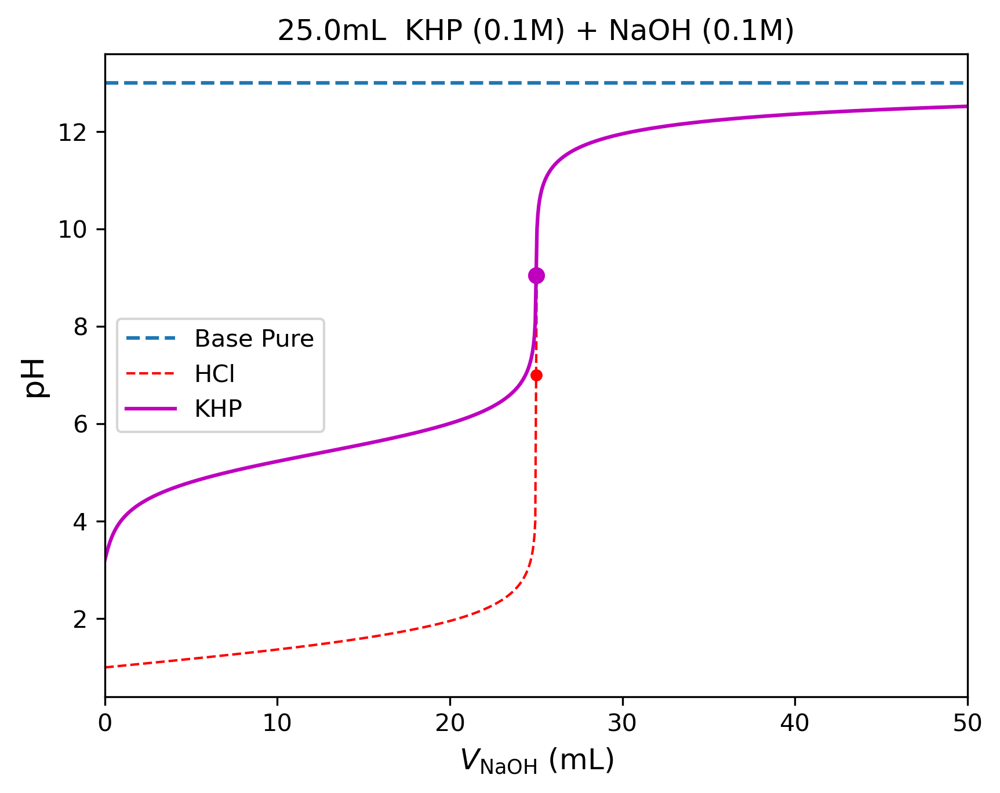
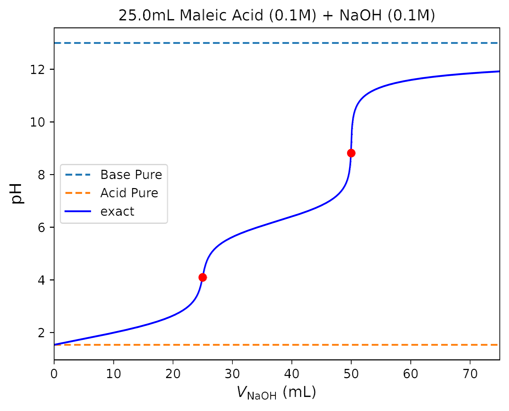

# 📊 Titration Curves of Strong, Weak, and Polyprotic Acids with Strong Base

## 🧠 Overview
This repository contains **numerically exact** titration curves of a strong acid (HCl), a weak acid (KHP), and a polyprotic acid (Maleic) with NaOH. These results are obtained by solving the full system of equilibrium equations rather than common approximations in introductory chemistry courses.

## 📈 Visualization

## 🔍 Description
- **Strong-Weak Acid Comparison:** A side-by-side comparison of hydrochloric acid (HCl) and potassium hydrogen phthalate (KHP) titrations with a sodium hydroxide (NaOH) solution.
- **Polyprotic Acid:** The titration curve of maleic acid, demonstrating the coupled **multi-ionic equilibrium** of a diprotic system.

## 💡 Key Insights
- These curves are generated by solving the full set of non-linear equilibrium equations (mass balance, charge balance, and water autoprotolysis). 
- This approach ensures high-fidelity results even in the extreme dilute limit or near equivalence points where standard approximations (like the Henderson-Hasselbalch equation) typically lose accuracy.

## 📌 Notes
The Python code used for the generation of these plots and the underlying numerical root-finding solutions is available upon request.
