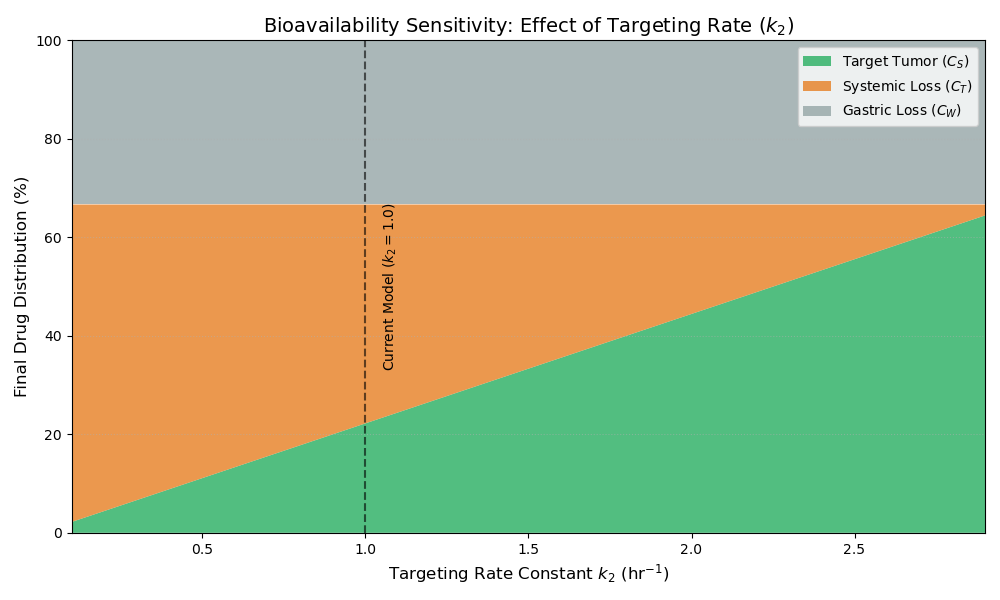

# Bioavailability & Sensitivity Analysis

## 🎯 Optimization Goal
The ultimate success of a pharmacokinetic system is measured by its **Bioavailability**: the fraction of the initial dose that successfully reaches the target site ($S$). In this model, the target accumulation competes with gastric degradation ($W$) and systemic protein-binding or loss ($T$).

## 📊 Sensitivity Analysis
The plot below demonstrates how the final distribution of the drug shifts as a function of the targeting rate constant (), while maintaining a constant systemic elimination rate sum.



### Distribution Breakdown
As , the system reaches a steady state where all of the drug has been distributed into one of the three "sink" compartments. The final percentages are calculated using the branching ratios of the competitive pathways:

* **Target Bioavailability ():** 
* **Systemic Loss ():** 
* **Gastric Loss ():** 

## 🔬 Key Insights
1.  **The Gastric Ceiling:** Regardless of how efficient the blood-to-tumor targeting becomes, the bioavailability is capped by the initial gastric degradation. In this model, with , at least **33.3%** of the drug is lost before it even enters the circulation.
2.  **Targeting Efficiency:** To achieve a bioavailability of >50%, the targeting rate  must be significantly higher than the systemic loss rate . 
3.  **Mass Balance Consistency:** The stacked area chart confirms the conservation of mass, as the sum of the three fractions always equals 100% of the initial dose .

## 🛠 Methodology
The sensitivity analysis was performed by sweeping  from 0.1 to 2.9 hr⁻¹ and calculating the asymptotic limits of the analytical solutions.

## 🚀 Run Sensitivity Study
Execute the script to view the interactive plot and explore different branching ratio scenarios:
```bash
python bioavailability_sensitivity_study.py
