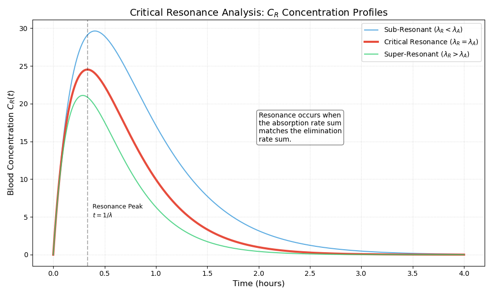

# Critical Resonance Analysis

## 🧠 The "Equal Rate" Phenomenon
In pharmacokinetics, the transition between compartments is usually governed by distinct rate constants. However, a unique mathematical state arises when the sum of the rates entering a compartment perfectly matches the sum of the rates leaving it:


This project analyzes this **Critical Resonance**, demonstrating how the system transitions from a standard bi-exponential response to a gamma-distribution profile.

## 📊 Comparative Simulation
The following analysis performs a parameter sweep around the resonance point (). We compare the blood concentration profiles () for three distinct cases:

1.  **Sub-Resonant:** Absorption is slower than elimination.
2.  **Critical Resonance:** Absorption and elimination are perfectly balanced (Critically Damped).
3.  **Super-Resonant:** Absorption is faster than elimination.



## 📐 Mathematical Limits
The general solution for the blood compartment is:
&space;=&space;\frac{k_1&space;C_{A_0}}{\lambda_R&space;-&space;\lambda_A}&space;\left(&space;e^{-\lambda_A&space;t}&space;-&space;e^{-\lambda_R&space;t}&space;\right))

As , the expression reaches an indeterminate form (0/0). Applying **L'Hôpital's Rule** with respect to the rate constant yields the resonant solution:

&space;=&space;\lim_{\lambda_R&space;\to&space;\lambda_A}&space;C_R(t)&space;=&space;k_1&space;C_{A_0}&space;t&space;e^{-\lambda_A&space;t})

## 🔬 Engineering Implications
* **Peak Optimization:** Critical resonance represents the point where the drug reaches its maximum theoretical concentration for a given total rate sum.
* **Sensitivity Analysis:** Small deviations from resonance (metabolic variability) significantly alter the shape of the therapeutic window, as shown in the super-resonant vs. sub-resonant curves above.
* **System Identification:** In clinical settings, observing a $t e^{-\lambda t}$ profile allows for the direct identification of matched physiological time constants.

## 🚀 Run Analysis
The sweep script generates the comparative plot and calculates the $t_{max}$ shift across the resonance boundary:
```bash
python critical_resonance_analysis.py
