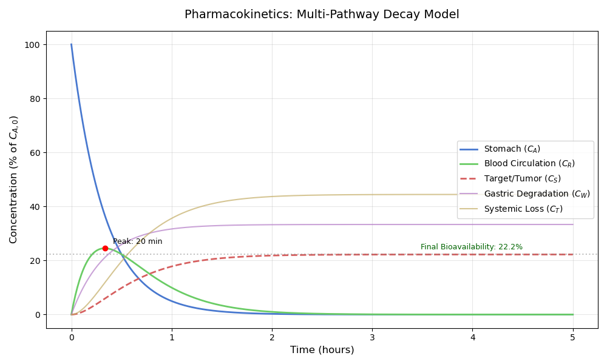

# Multi-Pathway Decay Model

## 🧪 Model Overview
This sub-project provides a detailed simulation of drug transport through a compartmental system characterized by competitive first-order reactions. The primary focus is the **Kinetic Resonance** case, where the total exit rate from the stomach is identical to the total exit rate from the blood circulation.

## 📝 Analytical Solution
For a system where , the concentration of the drug in the bloodstream does not follow a standard bi-exponential decay. Instead, it is described by a gamma-distribution profile:

=k_1C_{A_0}te^{-\lambda&space;t})

This represents a **critically damped** system, providing the maximum possible peak concentration for a given set of rate constants.

## 📊 Simulation Results

The plot below illustrates the concentration profiles over a 5-hour window, assuming an initial dose .



### Key Observations
1. **The Absorption Phase:** The drug in the stomach () decays purely exponentially, reaching near-zero levels within 2 hours.
2. **The Circulation Peak:** The blood concentration () reaches its maximum at . In this simulation (), the peak occurs at **20 minutes**.
3. **Bioavailability Plateau:** The final accumulation in the tumor () levels off at approximately **22.2%**. This value is determined by the "branching ratio" of the competitive pathways:
   (k_2+k_3)})

## 🛠 Methodology
The concentrations are calculated using the analytical solutions derived from the coupled ODE system. The Python implementation uses `numpy` for vectorized calculations and `matplotlib` for high-fidelity visualization.

### Parameter Set
| Parameter | Description | Value |
| :--- | :--- | :--- |
|  | Stomach → Blood | 2.0 hr⁻¹ |
|  | Stomach Degradation | 1.0 hr⁻¹ |
|  | Blood → Target | 1.0 hr⁻¹ |
|  | Systemic Loss | 2.0 hr⁻¹ |

## 🚀 Run Simulation
To regenerate these plots locally:
```bash
python pharmacokinetics_sim.py
