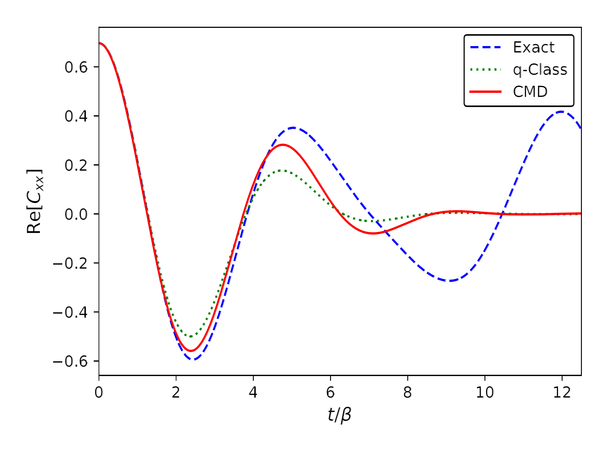

# 📊 Approximate Quantum Dynamics via New Phase-Space Mapping

## 🧠 Overview
This project explores the development and application of a novel phase-space mapping for quantum mechanical operators to generate approximate quantum dynamics. The benchmark results below evaluate the **real part** of the position–position correlation function for a one-dimensional **quartic oscillator** at an inverse temperature of **$\beta = 1.0$**, comparing exact quantum results against two distinct approximate mapping methods.

## 📈 Visualization

## 🔍 Description
- The **exact quantum time correlation function** (blue) is computed numerically via Hamiltonian diagonalization.  
- The **quasi-classical (q-class) result** (green) is obtained using the Wigner truncated approximation, which combines an initial Wigner distribution with classical dynamics.  
- The **CMD result** (red) corresponds to a centroid molecular dynamics–type approximation based on a novel phase-space mapping of quantum mechanical operators.  

## 💡 Key Insights
- The three methods agree at **t = 0**, where no dynamics occur and the quantum ensemble is represented exactly.
- As time evolves, both approximate methods (red and green) deviate from the exact quantum dynamics.
- The new phase-space mapping (red) provides improved accuracy over Wigner dynamics (green) due to the use of an effective force rather than a purely classical force.
- As in the Wigner approach, the accuracy of the new mapping can be systematically improved to arbitrary precision with increased computational effort.
- The new phase-space mapping is general and can describe the time evolution of any other operator.
- At high temperatures, both approximate approaches converge to the classical limit.
- In the harmonic limit, both methods reproduce the exact quantum dynamics.

## 📌 Notes
Code is available upon request.
