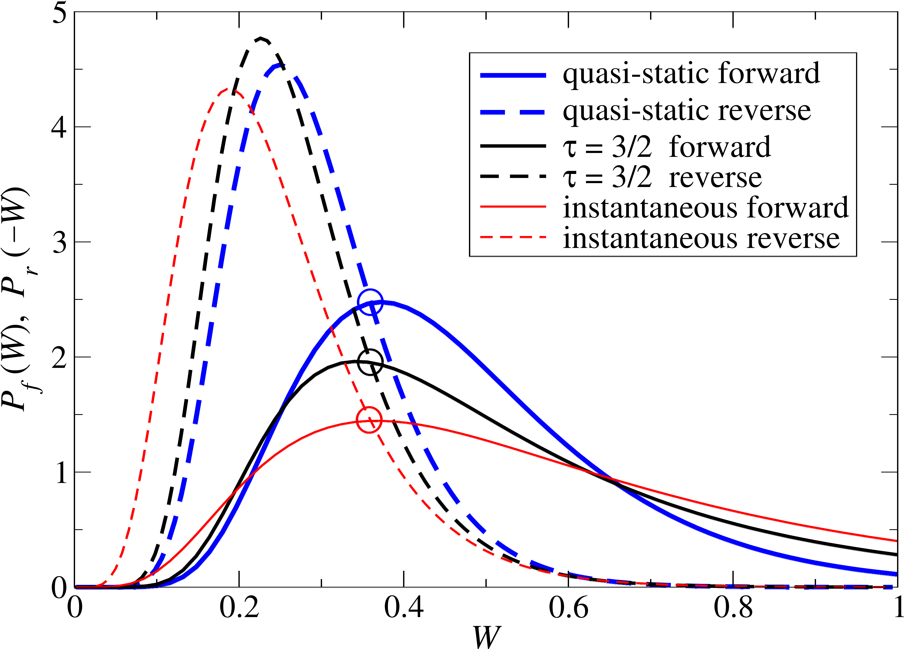

# 📊 Quantum Free Energy from Non-Equilibrium Path Integral Methods

## 🧠 Overview
This graph shows the irreversible work distribution for the forward and and reverse processes at different protocol speeds: quasistatic, finite process, and instantaneous. The distributions are determined analytically for a harmonic system.

## 📈 Visualization

## 🔍 What This Shows
- \(E_0 = 14.4 \, \text{keV}\) corresponds to the nuclear excitation energy of iron-57.  
- The line spacing is determined by the lattice vibrational frequency.  
- \(E_R\) represents the recoil kinetic energy of the nucleus.  
- For illustration, the graph depicts a “weakly bound” nucleus with \(E_R > \hbar \omega\); this parameter can be adjusted easily. In practice, \(E_R \approx \hbar \omega / 2\), leading to fewer spectral lines with larger spacing.

## 💡 Key Insights
- The spectrum illustrates quantum momentum transfer effects in gamma decay.  
- For a free nucleus, the spectrum would be continuous, since the Hamiltonian commutes with the momentum operator.  
- The discrete structure arises from the non-commutativity of the Hamiltonian and momentum operator in a bound system.  
- The spectral maximum is shifted below \(E_0\) (the nominal nuclear excitation energy) due to recoil effects.  
- Relativistic corrections lead to hyperfine line splitting, which can be incorporated analytically.  

## 📌 Notes
Code available upon request
