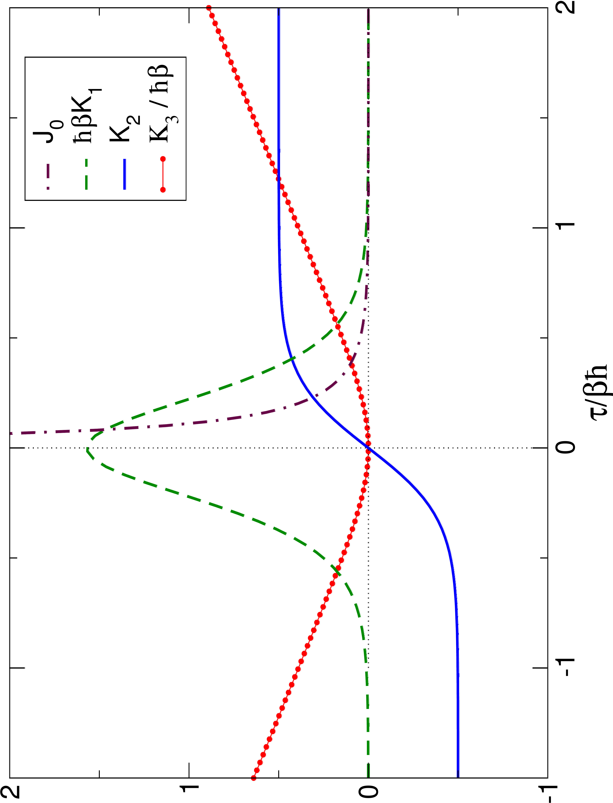

# 📊 Assessment of Approximate Quantum Dynamics via Sum Rules

## 🧠 Overview
This project establishes a rigorous framework for evaluating the accuracy of approximate quantum dynamics by utilizing exact sum rules. These identities relate the time-integrals of Kubo-transformed correlation functions to specific thermally symmetrized static averages.

## 📈 Visualization

## 🔍 Description
- **Weighting Kernels:** The figure illustrates the various kernels associated with different time-integrals of the Kubo correlation function and their corresponding static averages.
- **Ensemble Averages:** The kernel associated with the standard (ordinary) ensemble average decays rapidly, limiting its ability to probe long-time dynamics.
- **Symmetrized Statics:** The primary kernel associated with thermally symmetrized static averages exhibits a characteristic "bell-shaped" structure, analytically defined by the $\text{sech}^2(x)$ (or $1/\cosh^2(x)$) distribution.
- **High-Order Integrals:** Additional higher-order kernels are zero at $t=0$ and exhibit polynomial growth at large times. This allows for a systematic weighting of long-time dynamics during integration, providing a sensitive test for the stability of approximate methods.

## 💡 Key Insights
- **Robust Benchmarking:** Sum rules provide an exact method for assessing the quality of approximate quantum time correlation functions in non-trivial, multi-dimensional condensed phase systems.
- **Dynamics vs. Statics:** The assessment relies on a direct comparison between dynamic time-integrals and exact static averages. Because these averages contain no dynamical information, they can be computed accurately, serving as an "anchor" for evaluating approximate trajectories.
- **Validation of Approximations:** This framework is essential for validating semi-classical or imaginary-time path integral methods where exact quantum results are computationally inaccessible.

## 📌 Notes
Code and derivation details are available upon request.
