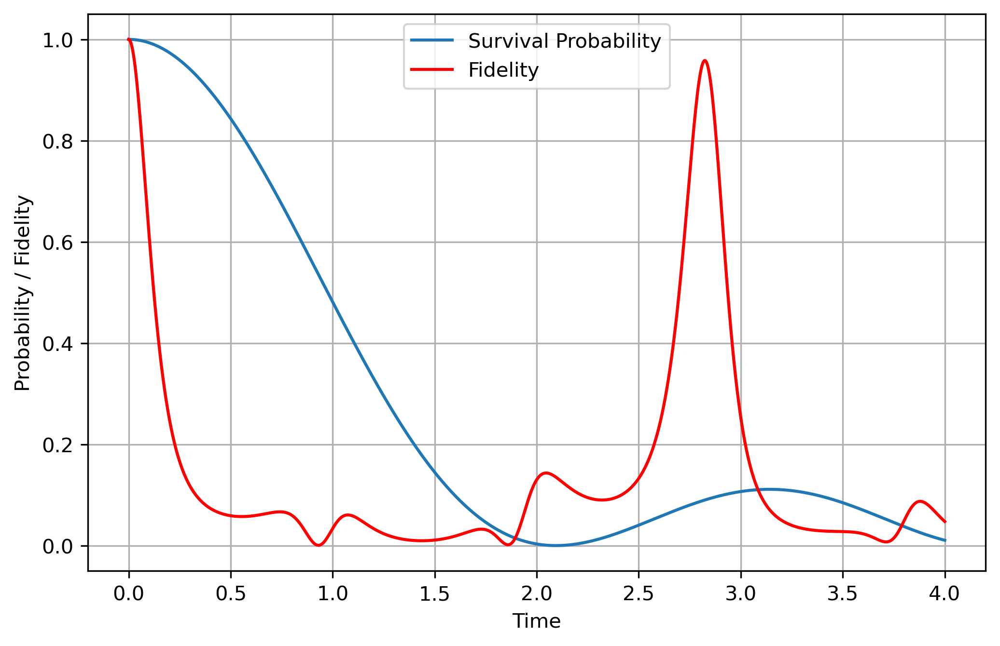

# Survival Probability and Fidelity as Unified Diagnostics for Quantum States

## 🧠 Overview

This project develops a unified dynamical framework for assessing the quality of approximate quantum states across electronic structure theory and quantum computing. The central idea is to use **time-dependent survival probability** and **fidelity** as systematic measures of wavefunction accuracy, stability, and sensitivity to perturbations.

Rather than focusing only on static quantities such as energies or densities, the approach examines how quantum states evolve under exact and perturbed Hamiltonians. This provides a physically transparent way to quantify correlation effects, approximation errors, and the expressive power of quantum algorithms.

The framework connects Hartree–Fock and post-HF wavefunctions, density functional theory via effective Hamiltonians, and variational quantum eigensolver (VQE) states, establishing a common language for evaluating classical and quantum representations of many-body systems.

---

## 🔬 Core Analyses

- Dynamical wavefunction diagnostics using survival probability under exact evolution  
- Fidelity analysis under Hamiltonian perturbations to quantify sensitivity  
- Correlation effects in electronic structure beyond Hartree–Fock theory  
- Unified comparison of HF, post-HF, DFT, and quantum circuit states  

---

## 📊 Available Results

### Model System Benchmarks

Benchmark studies using exactly solvable models reveal key dynamical behavior:

- Exact eigenstates: constant survival probability  
- Superposition states: oscillatory decay and revivals  
- Perturbed Hamiltonians: coherent fidelity oscillations driven by spectral differences  

These results highlight how small Hamiltonian perturbations lead to measurable long-time deviations in state overlap and dynamical stability.

---

## 📈 Key Quantities

### Survival Amplitude and Probability

=\langle\psi_0|e^{-iHt}|\psi_0\rangle)

=|A(t)|^2)

---

### Fidelity Between Two Evolutions

=\left|\langle\psi_0|e^{iHt}e^{-iH't}|\psi_0\rangle\right|^2)

---

### Definitions

- \(H\): exact Hamiltonian  
- \(H'\): approximate or perturbed Hamiltonian  
- \(|\psi_0\rangle\): initial quantum state  

## 🛠 Methodology

The approach combines analytical and computational tools:

- Exact diagonalization of model Hamiltonians  
- Time propagation of quantum states under different Hamiltonians  
- Construction of approximate states from HF, post-HF, and DFT methods  
- Effective Hamiltonian mapping for Kohn–Sham systems  
- Simulation of VQE states and quantum circuits  

Comparisons are performed by evolving identical initial states under different Hamiltonians and analyzing overlap decay and phase accumulation.

---

## 🔑 Key Insight

Survival probability and fidelity show that wavefunction accuracy is fundamentally dynamical rather than purely static.

Small differences in Hamiltonians or approximate states lead to phase accumulation over time, producing large deviations in long-time behavior even when short-time observables appear similar. This makes these quantities highly sensitive probes of:

- electronic correlation effects  
- limitations of approximate Hamiltonians  
- expressiveness of quantum ansätze  
- stability of quantum simulations  

---

## 🚀 Extensions

- Benchmarking HF, post-HF, and DFT on molecular systems  
- Construction of effective Hamiltonians for DFT analysis  
- Integration with VQE and quantum hardware simulations  
- Gate-efficiency analysis of quantum circuits via fidelity loss  
- Extension to open quantum systems and decoherence dynamics  
