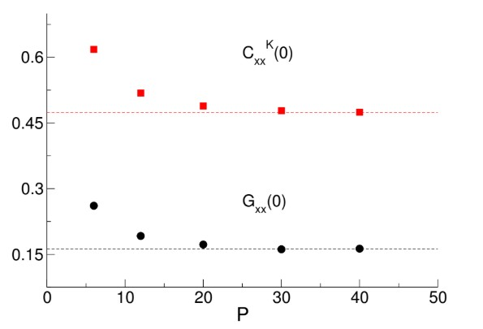
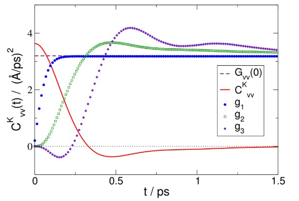

# Dynamics of Liquid Neon via Ring Polymer Molecular Dynamics

## 🧠 Overview
This project evaluates the accuracy of approximate quantum time correlation functions in condensed-phase systems. Specifically, we analyze the Kubo-transformed velocity quantum time correlation function obtained from Ring Polymer Molecular Dynamics (RPMD) for liquid neon at 30 K. The system is modeled as a Lennard-Jones fluid, and the thermally symmetrized static velocity average is compared with time integrals of the approximate Kubo velocity correlation function. This approach naturally allows us to assess progressively longer (and in principle arbitrarily long) times by employing a sequence of kernels.

## 🔬 Core Analyses
* **Velocity Autocorrelation Functions:** Calculation of the Kubo-transformed velocity autocorrelation function ($C_{vv}^K(t)$) and the thermally symmetrized correlation function ($G_{vv}(0)$).
* **Constraint Convergence:** Numerical testing of integral constraints to determine the time range over which RPMD remains accurate.
* **Diffusion Coefficient Estimation:** Evaluation of how discrepancies in the correlation function's structure at longer times may lead to an overestimation of self-diffusion.

---

## 📊 Liquid Neon Case Study

### Algorithmic Performance
* **Path Integral Convergence:** *The thermally symmetrized static average of the velocity, $G_{vv}(0)$, and the zero-time value of the Kubo-transformed velocity quantum time correlation function are shown to be sufficiently converged numerically at 20 "beads" ($P=20$) in the path integral results for liquid neon at 30 K. Furthermore, the quantitative difference between $C_{vv}^K(0)$ and $G_{vv}(0)$ measures the significance of quantum effects in liquid neon.*

  

* **Temporal Accuracy Mapping** *The numerical cumulative convergence in time of the constraints:*

&space;C^K_{AB}(t))

&space;\frac{dC^K_{AB}(t)}{dt})

&space;\right]&space;\frac{d^2&space;C^K_{AB}(t)}{dt^2})

*The cumulative integrals are shown in the figure below and compared with $G_{vv}(0)$. The analysis demonstrates high accuracy for times up to $\beta\hbar$ (approx. 0.26 ps), with a subsequent decrease in reliability as the trajectory reaches the minimum structure of the correlation function.*

  

  
---

## 🛠 Methodology
The simulations utilize **Ring Polymer Molecular Dynamics (RPMD)**, generating Hamiltonian trajectories from initial conditions drawn via Monte Carlo sampling from the Boltzmann distribution. Trajectories are integrated using a **velocity-Verlet algorithm** with a 4.6-femtosecond time step. The methodology relies on evaluating three distinct integral constraints to verify the correctness of the correlation function across different time scales relative to the quantum thermal time ($\beta\hbar$).

## 📌 Notes
* [Sum Rule Constraints and the Quality of Approximate Kubo-Transformed Correlation Functions.](https://pubs.acs.org/doi/abs/10.1021/acs.jpcb.5b07624)
