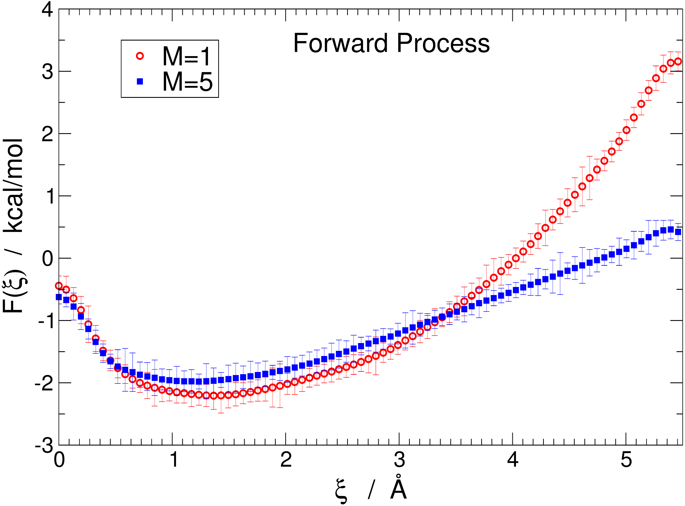

# Quantum Free Energy of Ion−Water Clusters

## 🧠 Overview
This project combines nonequilibrium simulation methods with rigid-body path-integral techniques to estimate the relevance of protonic quantum effects in the free energy of ion−water clusters. By applying advanced fluctuation theorems, the research quantifies how quantization influences the dissociation energy and transport kinetics of ionic systems in aqueous environments.

## 🔬 Core Analyses
* **Dissociation Free Energy:** Utilizing Crooks’ fluctuation relation to characterize quantum impacts on cluster stability.
* **Potential of Mean Force (PMF):** Evaluation of quantum effects on ionic reaction coordinates using Jarzynski’s work theorem.
* **Work Distribution Smoothing:** Implementation of rigorous smoothing procedures to accurately calculate the contribution of quantum work.

---

## 📊 Available Results

### Dissociation Free Energy
Select a system below to view the quantitative impact of quantization on cluster dissociation:

* **I−(H2O)5 Dissociation:** *The figure below shows irreversible work distributions for the classical and quantum system in the forward and reverse directions. The instersection of the work distribution represents the free energy of dissociation, and this is shifted in the quantum case as compared with the classical system. Findings indicate that quantum effects contribute approximately 11% to the dissociation free energy, marking them as non-negligible components of cluster stability. Analysis of show how protonic quantization alters the free energy landscape of small ion-water assemblies.*

### Potential of Mean Force
* **Na+(H2O)12 Dissociation:** *Significant quantum effects were identified in the potential of mean force, suggesting that quantization plays a critical role in the kinetics of ionic transport.*

---

## 🛠 Methodology
The research utilizes a hybrid approach merging **nonequilibrium simulation methods** with **rigid-body path-integral techniques**. The methodology relies on Jarzynski’s work theorem and Crooks’ fluctuation relation to extract equilibrium free energy differences from nonequilibrium work distributions, providing a rigorous framework for assessing quantization in aqueous ionic transport.
