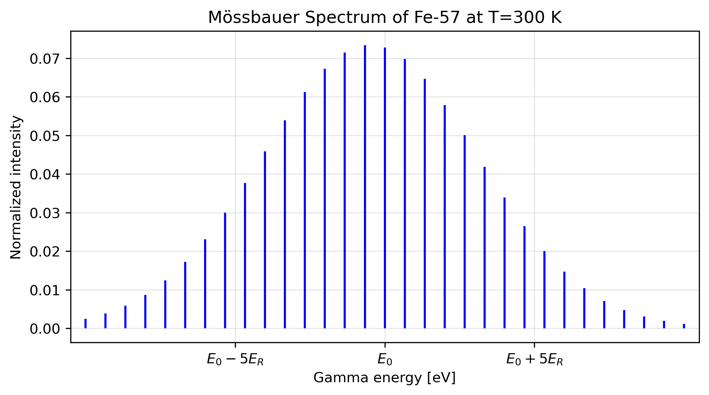

# 📊 Mossbauer Spectrum of Iron-57 at 300 K

## 🧠 Overview
This graph shows the gamma rays energy spectrum of Iron-57 in a 1D lattice at room temperature. The lattice is assumed to be harmonic and the spectrum is fully determined analytically.

## 📈 Visualization

## 🔍 What This Shows
- Peaks correspond to nuclear energy levels of Iron-57
- Line spacing is determined by lattice frequency
- E_R represents the kinetic energy of recoil
- Splitting shows hyperfine interactions in the lattice  

## 💡 Key Insights
- Discrete nature of the spectrum is due to lack of commumativity of system Hamiltonian and momentum operator
- The analogous spectrum of a free nucleus is therefore cotinuous
- Relativistic effects can lead to line hyperfine splitting and can be added analytically

## 📌 Notes
Code available upon request
