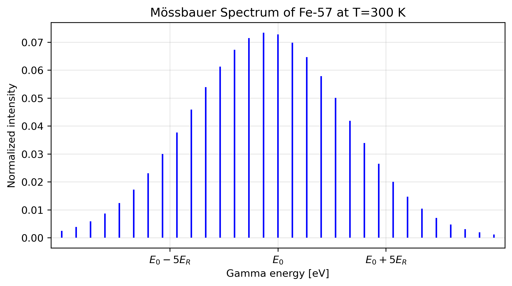
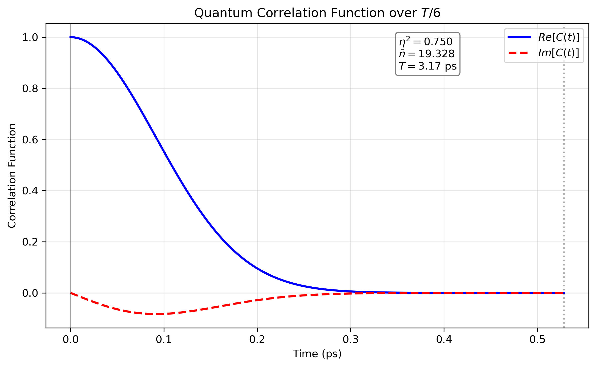

# 📊 Solid State Mössbauer Spectra and Lattice Dynamics

## 🧠 Overview
This graph shows the gamma-ray energy spectrum of $^{57}\text{Fe}$ in a 1D harmonic lattice at room temperature ($T = 300\text{ K}$). The spectrum is derived from a fully analytical model of the nuclear-vibrational coupling.

## 📈 Visualization

  

*   **$E_0 = 14.4\text{ keV}$:** The nominal nuclear excitation energy of Iron-57.
*   **Line Spacing:** Determined by the lattice vibrational frequency ($\omega$).
*   **$E_R$:** Represents the recoil kinetic energy of the nucleus.
*   **Modeling Note:** For illustration, the graph depicts a "weakly bound" nucleus ($E_R > \hbar\omega$). In typical rigid solids, $E_R \approx \hbar\omega / 2$, which results in a more dominant zero-phonon line and fewer, more widely spaced sidebands.

---

## 🔍 Lattice Dynamics

The spectrum above is the Fourier transform of the **intermediate scattering function**, a periodic quantum time correlation function of the lattice dynamics:

%20=%20\langle%20e^{ik\hat{x}(0)}%20e^{-ik\hat{x}(t)}%20\rangle)

The figure below shows the real and imaginary parts of this correlation function for the parameters:
*   **Correlation Period:** $3.17\text{ ps}$
*   **Coupling Parameter ($\eta^2$):** $0.750$
*   **Mean Phonon Occupancy ($\bar{n}$):** $19.328$

  

---

## 💡 Key Insights
*   **Momentum Transfer:** The spectrum illustrates quantized momentum transfer between the gamma photon and the lattice.
*   **Discreteness:** For a free nucleus, the spectrum is continuous. The discrete "stick" structure arises because the lattice Hamiltonian does not commute with the momentum operator, restricting energy exchange to integer multiples of $\hbar\omega$.
*   **Recoil Shift:** The spectral maximum is shifted below $E_0$ due to the energy lost to the lattice (recoil effect), though the "recoil-free" fraction remains at $E_0$.
*   **Symmetry:** The asymmetry between the left and right sidebands is a signature of **detailed balance**, reflecting the different probabilities of phonon emission versus absorption at finite temperatures.

## 📌 Notes
*   Relativistic corrections and hyperfine splitting can be incorporated via additional analytical terms.
*   Simulation code (Python/NumPy) is available upon request.
